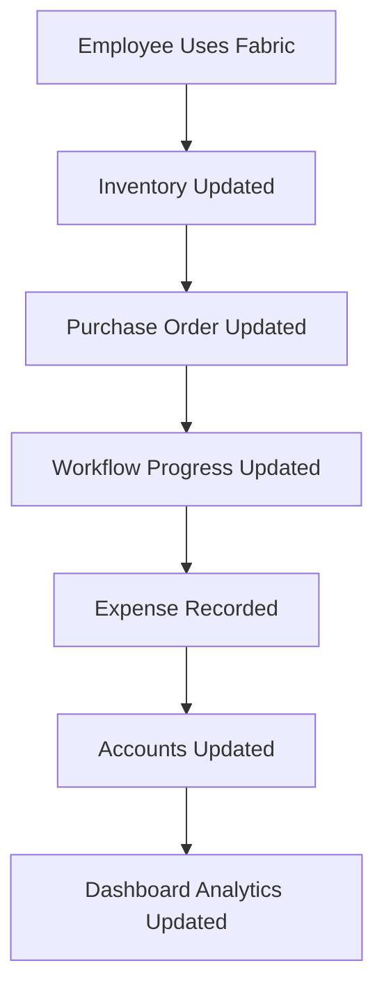
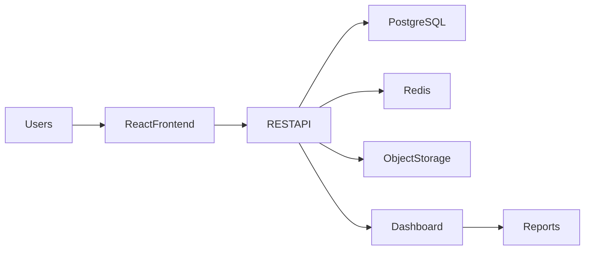
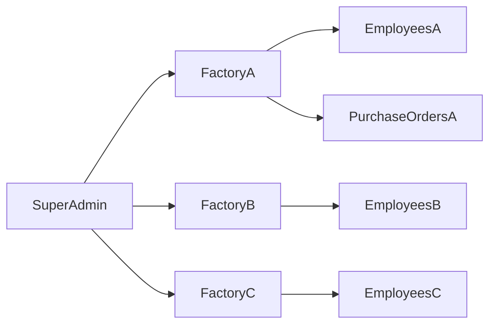

# Factory Management System (FMS)

> **Project Type:** Multi-Tenant SaaS ERP  
> **Version:** 1.0.0  
> **Status:** Planning Phase  
> **Document Type:** Project Overview  
> **Audience:** Developers, Product Managers, Designers, QA Engineers, DevOps Engineers, AI Assistants, Stakeholders

---

# Table of Contents

1. Executive Summary
2. Introduction
3. Business Background
4. Vision
5. Mission
6. Problem Statement
7. Proposed Solution
8. Project Objectives
9. Business Goals
10. Stakeholders
11. Target Users
12. Project Scope
13. Core Features
14. System Overview
15. High-Level Architecture
16. Technology Stack
17. Functional Requirements
18. Non-Functional Requirements
19. Success Metrics
20. Future Vision
21. Risks
22. Assumptions
23. Constraints
24. Glossary
25. Related Documents

---

# 1. Executive Summary

The **Factory Management System (FMS)** is a cloud-ready, multi-tenant Enterprise Resource Planning (ERP) platform designed to digitize and automate factory operations.

The system replaces fragmented tools such as spreadsheets, notebooks, and disconnected software with a centralized platform where inventory, employees, production, purchase orders, workflows, attendance, wages, and financial reporting work together seamlessly.

Rather than acting as independent modules, every component of the system shares a common database and business logic. This ensures that information entered once becomes available throughout the application, reducing duplicate work and improving operational accuracy.

The platform is designed to support factories of different sizes while maintaining strict tenant isolation, allowing multiple businesses to use the same application securely.

---

# 2. Introduction

Manufacturing businesses perform hundreds of operational activities every day.

Examples include:

- Purchasing raw materials
- Receiving customer orders
- Assigning work
- Tracking production
- Paying employees
- Managing inventory
- Recording expenses
- Calculating profits

Many small and medium-sized factories still rely on paper registers or spreadsheets for these tasks.

As factories grow, these manual processes become difficult to manage, leading to delays, inaccuracies, and poor visibility into operations.

The Factory Management System provides a centralized digital solution that integrates all major factory functions into one application.

---

# 3. Business Background

Manufacturing is a process-driven industry.

Every product passes through multiple production stages before reaching the customer.

For example:

```text
Customer Order
      │
      ▼
Purchase Order
      │
      ▼
Raw Material Allocation
      │
      ▼
Cutting
      │
      ▼
Stitching
      │
      ▼
Finishing
      │
      ▼
Packing
      │
      ▼
Delivery
```

Every stage generates valuable business data:

- Material consumption
- Employee productivity
- Production costs
- Time spent
- Revenue
- Profit

Without an integrated ERP, this information is scattered across multiple records, making accurate reporting difficult.

---

# 4. Vision

To build a modern, intelligent, and scalable ERP platform that enables manufacturing businesses to manage their complete operations from a single application while providing real-time visibility into production, inventory, workforce, and financial performance.

---

# 5. Mission

Our mission is to simplify factory management by replacing manual processes with an intuitive, reliable, and scalable digital platform that improves operational efficiency, reduces errors, and supports long-term business growth.

---

# 6. Problem Statement

Factories commonly face the following challenges:

| Problem | Impact |
|----------|---------|
| Manual inventory tracking | Incorrect stock levels |
| Paper attendance | Payroll errors |
| Spreadsheet-based accounting | Slow reporting |
| No production visibility | Delayed deliveries |
| No workflow tracking | Poor productivity |
| Duplicate data | Human errors |
| Isolated systems | Difficult decision-making |

These problems reduce efficiency and increase operational costs.

---

# 7. Proposed Solution

The Factory Management System unifies factory operations through a modular ERP architecture.

Whenever a business event occurs, all related modules update automatically.

Example:



This interconnected approach eliminates duplicate data entry and improves operational transparency.

---

# 8. Project Objectives

The project aims to:

- Digitize all major factory operations
- Reduce paperwork
- Automate repetitive tasks
- Improve production tracking
- Increase inventory accuracy
- Improve financial reporting
- Support multiple factories on one platform
- Provide real-time business insights

---

# 9. Business Goals

The long-term business goals include:

- Offer the application as a SaaS platform
- Support hundreds of factories
- Enable subscription-based licensing
- Reduce operational costs for customers
- Improve manufacturing efficiency
- Build a scalable cloud-native ERP

---

# 10. Stakeholders

| Stakeholder | Responsibility |
|-------------|----------------|
| Platform Owner | Owns the SaaS platform |
| Super Admin | Manages factory accounts |
| Factory Admin | Operates one factory |
| Production Manager | Monitors production |
| HR | Employee management |
| Accountant | Financial operations |
| Store Keeper | Inventory management |
| Developers | Build and maintain the system |
| QA Engineers | Quality assurance |
| Designers | User experience |

---

# 11. Target Users

Primary users include:

- Factory Owners
- Factory Managers
- Production Supervisors
- HR Staff
- Accountants
- Inventory Managers

Each user interacts with different modules based on role-based permissions.

---

# 12. Project Scope

Version 1 includes:

- Authentication
- Multi-Tenant Architecture
- Dashboard
- Employees
- Attendance
- Wages
- Inventory
- Daily Material Usage
- Purchase Orders
- Production Workflows
- Kanban Tracking
- Accounts
- Reports

Excluded from Version 1:

- Mobile applications
- AI forecasting
- Barcode hardware integration
- IoT devices
- Multi-language support

---

# 13. Core Features

| Category | Features |
|-----------|----------|
| Administration | Authentication, Authorization, Tenant Management |
| Inventory | Materials, Stock, Usage |
| Production | Workflows, Kanban, Purchase Orders |
| HR | Employees, Attendance, Wages |
| Finance | Expenses, Revenue, Profit & Loss |
| Analytics | KPIs, Charts, Reports |

---

# 14. High-Level System Overview



---

# 15. Multi-Tenant Concept



Every record owned by a factory contains a `tenant_id`, ensuring complete data isolation.

---

# 16. Technology Stack

| Layer | Technology |
|---------|------------|
| Frontend | React + Vite |
| Backend | Node.js + Express |
| Database | PostgreSQL |
| ORM | Prisma |
| Authentication | JWT |
| Cache | Redis |
| Charts | Recharts |
| File Storage | AWS S3 / Cloudinary |
| Containerization | Docker |

---

# 17. Functional Requirements

The system shall:

- Authenticate users
- Authorize access based on role
- Manage factory data
- Track inventory
- Track production
- Manage purchase orders
- Calculate wages
- Generate reports
- Produce dashboards

---

# 18. Non-Functional Requirements

| Requirement | Goal |
|-------------|------|
| Availability | ≥ 99.9% uptime |
| Security | Role-based access control |
| Performance | Fast response times |
| Scalability | Support many factories |
| Maintainability | Modular architecture |
| Accessibility | WCAG 2.2 AA compliance |
| Reliability | Automated backups |

---

# 19. Success Metrics

The project will be considered successful if:

- Factory operations are fully digitized.
- Purchase orders can be tracked end-to-end.
- Inventory remains accurate.
- Reports are generated correctly.
- Tenant data remains isolated.
- The system performs reliably under expected workloads.

---

# 20. Risks

Potential risks include:

- Poor database design affecting scalability
- Complex production workflows
- Incorrect permission handling
- Data migration challenges
- Performance bottlenecks with large datasets

These risks will be addressed through careful architecture, testing, and documentation.

---

# 21. Assumptions

- Each factory has one primary administrator.
- Users have internet access.
- Production stages are configurable.
- Factories maintain accurate operational data.

---

# 22. Constraints

- Web-first application
- Relational database
- RESTful API architecture
- Multi-tenant data isolation
- Responsive design for desktop and tablets

---

# 23. Glossary

| Term | Definition |
|------|------------|
| ERP | Enterprise Resource Planning |
| Tenant | A factory using the platform |
| Workflow | Configurable sequence of production stages |
| Purchase Order | Customer manufacturing request |
| Bundle | Batch of products moving through production |
| Kanban | Visual workflow management board |

---

# 24. Related Documents

- 02-business-requirements.md
- 03-system-architecture.md
- 04-database-design.md
- 05-api-documentation.md
- 06-authentication.md
- 07-user-roles.md
- 08-module-documentation/
- 09-workflows.md

---

# Document History

| Version | Date | Author | Changes |
|----------|------|--------|---------|
| 1.0.0 | July 2026 | ERP Team | Initial project overview |