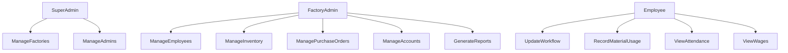

# Business Requirements

**Project Name:** Factory Management System (ERP)

**Version:** 1.0

**Document Owner:** Development Team

---

# 1. Purpose

This document defines the business requirements for the Factory Management System (ERP). It explains what the business expects the system to achieve, who will use it, the problems it solves, and the functional and non-functional requirements that must be satisfied.

The purpose of this document is to ensure all stakeholders share the same understanding before development begins.

---

# 2. Business Objectives

The Factory Management System should help manufacturing businesses achieve the following objectives:

- Digitize factory operations
- Replace manual paperwork
- Reduce operational costs
- Improve employee productivity
- Increase production visibility
- Improve inventory control
- Track purchase orders efficiently
- Generate real-time reports
- Support multiple factories from a single platform
- Enable informed business decisions through analytics

---

# 3. Business Problems

The current manual system causes several operational challenges.

| Problem | Business Impact |
|----------|-----------------|
| Paper-based records | Data loss and duplication |
| Manual inventory tracking | Stock shortages and overstocking |
| Manual attendance | Payroll inaccuracies |
| No production tracking | Delayed deliveries |
| No workflow management | Production bottlenecks |
| Separate spreadsheets | Difficult reporting |
| Manual financial calculations | Human errors |
| No centralized system | Poor business visibility |

---

# 4. Business Solution

The Factory Management System provides a centralized ERP platform that automates factory operations and stores all business information in a single database.

The system enables businesses to:

- Manage employees
- Track attendance
- Calculate wages
- Manage inventory
- Record material consumption
- Create production workflows
- Manage purchase orders
- Monitor production progress
- Generate financial reports
- Analyze factory performance

---

# 5. Stakeholders

| Stakeholder | Responsibility |
|--------------|----------------|
| Factory Owner | Business decisions and approvals |
| Super Admin | Platform administration |
| Factory Admin | Daily factory management |
| Employees | Production activities |
| Customers | Place purchase orders |
| Development Team | Build and maintain the system |

---

# 6. User Roles

## Super Admin

Responsible for managing the ERP platform.

Responsibilities:

- Create factory accounts
- Manage tenant accounts
- Activate or deactivate factories
- Monitor platform usage

---

## Factory Admin

Responsible for managing a single factory.

Responsibilities:

- Manage employees
- Manage inventory
- Manage purchase orders
- Configure workflows
- Monitor production
- Generate reports
- Manage accounts

---

## Employee

Responsible for production activities.

Responsibilities:

- View assigned work
- Update workflow progress
- Record material usage
- View attendance
- View wage information

---

# 7. Functional Requirements

## Authentication

- Secure login
- JWT authentication
- Password hashing
- Password reset
- Session management

---

## User Management

- Create users
- Update users
- Delete users
- Manage roles
- Manage permissions

---

## Employee Management

The system shall allow administrators to:

- Add employees
- Edit employee information
- Delete employees
- Search employees
- Filter employees
- View employee profiles

---

## Attendance Management

The system shall allow administrators to:

- Mark attendance
- View attendance history
- Search attendance
- Generate attendance reports

---

## Wage Management

The system shall:

- Calculate wages
- Record advances
- Track pending payments
- Generate wage reports

---

## Raw Material Management

The system shall:

- Add materials
- Update inventory
- Track stock quantity
- Monitor stock availability
- View stock history

---

## Daily Material Usage

The system shall:

- Assign materials
- Record consumption
- Track remaining stock
- View material history

---

## Workflow Builder

The system shall allow administrators to:

- Create workflows
- Define workflow stages
- Configure stage expenses
- Configure wages
- Configure required employees

Example:

Cutting

↓

Stitching

↓

Printing

↓

Ironing

↓

Packaging

---

## Purchase Order Management

The system shall:

- Create purchase orders
- Generate unique PO numbers
- Assign workflows
- Track order progress
- Calculate costs
- Monitor completion

---

## Kanban Board

The system shall:

- Display workflow stages
- Show active purchase orders
- Support drag-and-drop movement
- Display production progress
- Display stage details

---

## Accounts

The system shall:

- Record expenses
- Record revenue
- Calculate profit
- Generate financial summaries

---

## Dashboard

The dashboard shall display:

- Sales
- Revenue
- Expenses
- Purchase Orders
- Employee statistics
- Inventory statistics
- Production progress

---

## Reports

The system shall generate:

- Employee reports
- Attendance reports
- Wage reports
- Inventory reports
- Purchase order reports
- Financial reports

---

# 8. Non-Functional Requirements

| Category | Requirement |
|----------|-------------|
| Performance | API responses should be fast under normal load |
| Security | JWT, RBAC, password hashing, input validation |
| Scalability | Support multiple factories without redesign |
| Reliability | Prevent data loss and ensure consistent operation |
| Availability | High uptime with proper backup strategy |
| Maintainability | Modular architecture and clean code |
| Usability | Responsive and intuitive interface |
| Compatibility | Support modern desktop and tablet browsers |

---

# 9. Business Rules

## Multi-Tenant Isolation

Each factory must only access its own data.

Factory A must never be able to view Factory B's information.

---

## Purchase Order Rules

- Every purchase order must have a unique PO number.
- Every purchase order belongs to one factory.
- Every purchase order must have at least one workflow stage.
- A purchase order cannot be marked as completed until all workflow stages are completed.

---

## Inventory Rules

- Material quantity cannot become negative.
- Stock updates must be recorded.
- Material usage must be linked to an employee.

---

## Attendance Rules

- One attendance record per employee per day.
- Attendance cannot be modified after payroll processing without authorization.

---

## Wage Rules

- Wages are calculated based on completed work and configured rates.
- Advances reduce pending payments.
- Payment history must be retained.

---

# 10. Use Case Diagram

---

# 11. Acceptance Criteria

The project will be considered complete when:

- All core modules are functional.
- Tenant data is fully isolated.
- Authentication and authorization are implemented.
- CRUD operations work correctly.
- Purchase order workflow functions end-to-end.
- Kanban board accurately reflects production stages.
- Reports display correct information.
- The application is responsive across supported devices.
- Security best practices are followed.

---

# 12. Requirement Traceability Matrix

| Requirement ID | Description | Module |
|----------------|-------------|--------|
| BR-001 | User Authentication | Authentication |
| BR-002 | Role-Based Access Control | Authentication |
| BR-003 | Employee Management | Employees |
| BR-004 | Attendance Tracking | Attendance |
| BR-005 | Wage Management | Wages |
| BR-006 | Raw Material Management | Inventory |
| BR-007 | Material Usage Tracking | Daily Usage |
| BR-008 | Workflow Builder | Workflow |
| BR-009 | Purchase Order Management | Purchase Orders |
| BR-010 | Kanban Board | Kanban |
| BR-011 | Financial Management | Accounts |
| BR-012 | Reporting & Analytics | Dashboard & Reports |

---

# 13. Assumptions

- Each factory is managed independently.
- Internet connectivity is available during operation.
- Users have appropriate role-based permissions.
- The relational database is properly configured and backed up.

---

# 14. Constraints

- The application is web-based.
- Initial release targets desktop and tablet devices.
- REST APIs are used for client-server communication.
- The system uses a relational database.
- Authentication is based on JWT.

---

# 15. Conclusion

This document defines the business needs and expected behavior of the Factory Management System. It serves as the foundation for architecture, database design, API development, user interface design, and testing. By clearly defining business objectives, user roles, requirements, and rules, the project can be developed in a structured, maintainable, and production-ready manner.