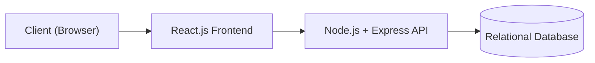
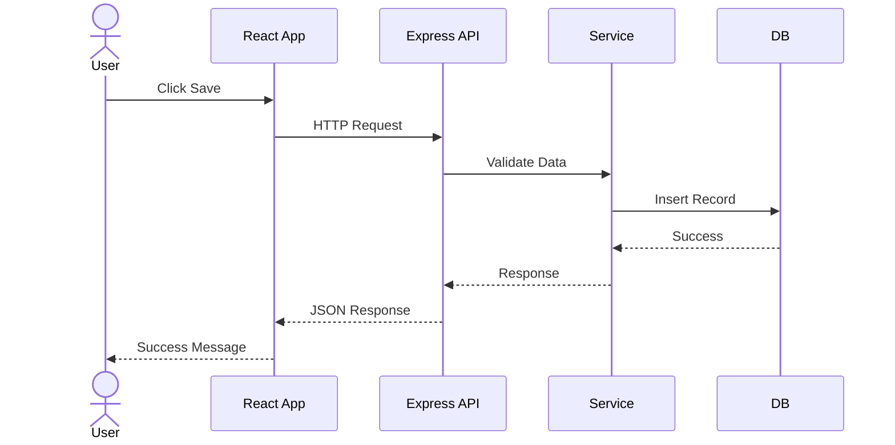
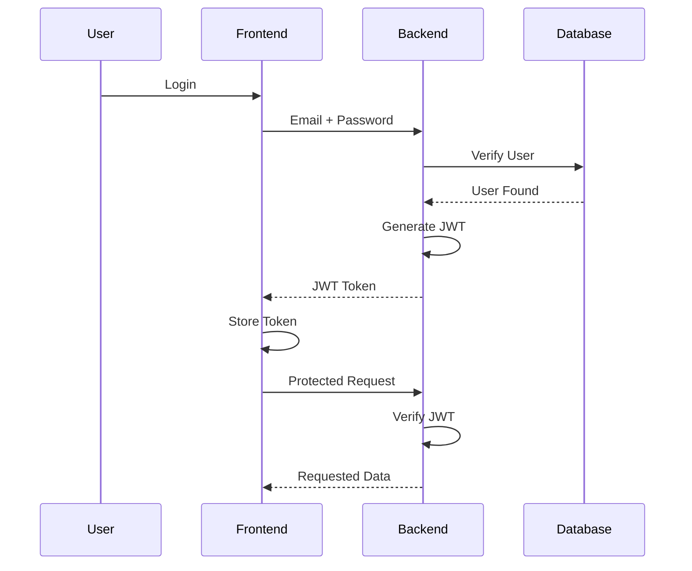
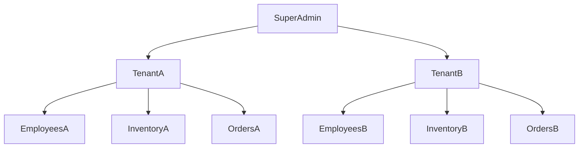
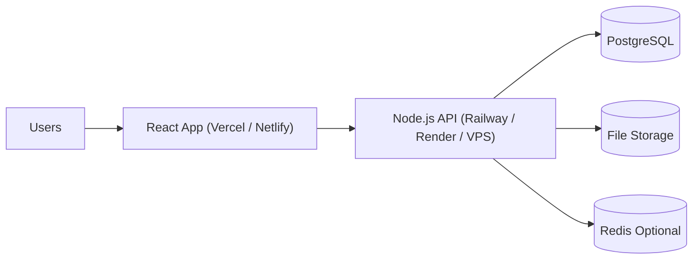

# System Architecture

**Project Name:** Factory Management System (ERP)

**Version:** 1.0

**Document Owner:** Development Team

---

# 1. Purpose

This document describes the overall architecture of the Factory Management System. It explains how different parts of the system interact, why specific technologies were selected, and how the application is structured to ensure scalability, security, maintainability, and performance.

The goal is to provide developers with a clear architectural blueprint before implementation begins.

---

# 2. Architecture Goals

The architecture is designed to achieve the following objectives:

- Modular and maintainable codebase
- Clear separation of concerns
- Secure authentication and authorization
- Tenant data isolation
- Scalability for future growth
- High performance
- Easy testing and debugging
- Simple deployment
- Production-ready structure

---

# 3. High-Level Architecture

The Factory Management System follows a **3-Tier Architecture**, separating the application into presentation, business logic, and data layers.



---

# 4. Why 3-Tier Architecture?

Separating responsibilities makes the application easier to maintain and scale.

| Layer | Responsibility |
|--------|----------------|
| Presentation Layer | User Interface |
| Business Layer | Business Logic |
| Data Layer | Data Storage |

### Benefits

- Easier maintenance
- Independent frontend and backend
- Better security
- Improved scalability
- Cleaner code organization

---

# 5. Technology Stack

## Frontend

| Technology | Purpose |
|------------|---------|
| React.js | User Interface |
| React Router | Routing |
| Axios | API Requests |
| Tailwind CSS | Styling |
| TanStack Query (React Query) | Server state management |
| React Hook Form | Forms |
| Zod | Validation |
| Recharts | Charts |
| Lucide React | Icons |

---

## Backend

| Technology | Purpose |
|------------|---------|
| Node.js | Runtime |
| Express.js | REST API |
| JWT | Authentication |
| bcrypt | Password Hashing |
| Prisma ORM | Database Access |
| Zod/Joi | Validation |
| Multer | File Uploads |
| Winston/Pino | Logging |

---

## Database

| Technology | Purpose |
|------------|---------|
| PostgreSQL | Relational Database |
| Prisma | ORM |
| Redis *(Optional)* | Caching & Sessions |

---

# 6. System Components

```text
React Frontend
│
├── Authentication
├── Dashboard
├── Employees
├── Attendance
├── Wages
├── Inventory
├── Purchase Orders
├── Workflows
├── Kanban
├── Reports
└── Settings

↓

Express REST API

↓

Business Services

↓

Database
```

---

# 7. Request Lifecycle

The following diagram shows how a typical request flows through the system.



---

# 8. Authentication Flow

The application uses **JWT (JSON Web Token)** for secure authentication.



---

# 9. Authorization Strategy

The system implements **Role-Based Access Control (RBAC)**.

| Role | Permissions |
|------|-------------|
| Super Admin | Manage all factories |
| Factory Admin | Manage one factory |
| Employee | Limited operational access |

Example:

```text
Super Admin

├── Create Factory
├── Manage Admins
└── View Platform

Factory Admin

├── Employees
├── Inventory
├── Purchase Orders
├── Accounts
└── Reports

Employee

├── View Assigned Work
├── Update Workflow
└── Record Material Usage
```

---

# 10. Multi-Tenant Architecture

Each factory acts as an independent tenant.



Every business record includes a `tenantId` (or `factoryId`) to ensure complete data isolation.

Example:

| Employee | Factory |
|-----------|----------|
| Ali | Factory A |
| Ahmad | Factory A |
| Sara | Factory B |

Factory A users cannot access Factory B data.

---

# 11. Backend Architecture

The backend follows a layered architecture.

```text
Routes

↓

Controllers

↓

Services

↓

Repositories

↓

Database
```

### Responsibilities

### Routes

- Define API endpoints
- Apply middleware
- Forward requests

---

### Controllers

- Receive requests
- Validate inputs
- Call services
- Return responses

---

### Services

- Business logic
- Calculations
- Workflow rules
- Tenant validation

---

### Repositories

- Database operations
- Queries
- CRUD operations

---

# 12. Frontend Architecture

The frontend follows a feature-based structure.

```text
src/

├── app/
├── components/
├── features/
├── layouts/
├── pages/
├── routes/
├── hooks/
├── services/
├── utils/
├── types/
└── assets/
```

### Benefits

- Easy navigation
- Reusable components
- Better scalability
- Cleaner project organization

---

# 13. API Communication

The frontend communicates with the backend using REST APIs.

Example:

```text
GET    /employees

POST   /employees

PUT    /employees/:id

DELETE /employees/:id
```

Responses use JSON.

Example

```json
{
  "success": true,
  "message": "Employee created successfully",
  "data": {}
}
```

---

# 14. Error Handling Strategy

Every API should return consistent responses.

Success

```json
{
  "success": true,
  "data": {}
}
```

Validation Error

```json
{
  "success": false,
  "message": "Validation failed",
  "errors": []
}
```

Server Error

```json
{
  "success": false,
  "message": "Internal Server Error"
}
```

---

# 15. Security Architecture

The application follows multiple security layers.

- JWT Authentication
- Role-Based Authorization
- Password Hashing (bcrypt)
- Input Validation
- SQL Injection Protection (Prisma ORM)
- HTTPS
- CORS
- Rate Limiting
- Secure HTTP Headers (Helmet)
- Environment Variables
- Audit Logging (optional)

---

# 16. Deployment Architecture



---

# 17. Scalability Strategy

The architecture is designed to support future growth.

Possible future improvements:

- Redis caching
- CDN for assets
- Horizontal API scaling
- Queue processing (BullMQ)
- Microservices (if needed)
- Object storage (AWS S3)
- WebSockets for real-time updates

These are not required for the first release but can be added without major redesign.

---

# 18. Architectural Decisions

| Decision | Reason |
|----------|--------|
| React.js | Component-based, reusable UI |
| Express.js | Lightweight and flexible REST API |
| PostgreSQL | Reliable relational database with strong ACID compliance |
| Prisma ORM | Type-safe database access and easier migrations |
| JWT | Stateless authentication suitable for REST APIs |
| Tailwind CSS | Fast, consistent, utility-first styling |
| Feature-based frontend structure | Improves scalability and maintainability |
| Layered backend architecture | Separates concerns and simplifies testing |
| Multi-tenancy | Supports multiple factories in one application while isolating data |

---

# 19. Architecture Summary

The Factory Management System follows a modern layered architecture that separates the user interface, business logic, and data storage. By combining React, Express, PostgreSQL, and Prisma with role-based access control and multi-tenant design, the application remains secure, scalable, and easy to maintain. This architecture provides a strong foundation for future enhancements while keeping the initial implementation simple and production-ready.