# Database Design (Part 2)

**Project Name:** Factory Management System (ERP)

**Document Version:** 1.0

---

# Table of Contents

1. Employee Management
2. Employees Table
3. Departments Table
4. Designations Table
5. Entity Relationships
6. Business Rules
7. Validation Rules

---

# 1. Employee Management

## Purpose

The Employee Management module stores and manages all employees working in a factory.

It acts as the central source of employee information for multiple modules, including:

- Attendance
- Wages
- Purchase Orders
- Workflow Assignment
- Daily Material Usage
- Reports

Every employee belongs to exactly one factory (tenant).

---

# Employee Module Overview

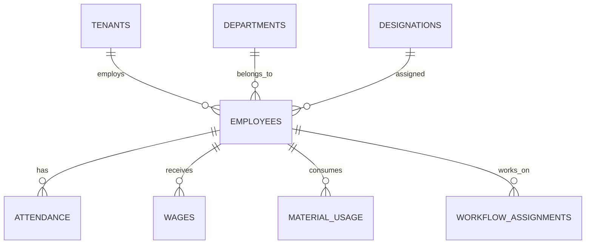

---

# 2. Employees Table

## Purpose

Stores information about every employee working in a factory.

This table contains personal and employment-related information only.

Attendance, salaries, and production activities are stored in separate tables.

---

## Why Separate Employee Data?

Separating employee information from attendance and payroll keeps the database normalized.

Benefits:

- No duplicated employee data
- Easier updates
- Better performance
- Cleaner relationships

---

## Table Structure

| Column | Type | Constraints | Description |
|----------|------|------------|-------------|
| id | UUID | PK | Employee ID |
| tenant_id | UUID | FK | Factory |
| department_id | UUID | FK | Department |
| designation_id | UUID | FK | Designation |
| employee_code | VARCHAR(30) | UNIQUE (per tenant) | Employee Code |
| first_name | VARCHAR(100) | NOT NULL | First Name |
| last_name | VARCHAR(100) | NOT NULL | Last Name |
| gender | ENUM | Male, Female, Other | Gender |
| phone | VARCHAR(20) | | Phone Number |
| email | VARCHAR(255) | NULL | Email |
| address | TEXT | | Address |
| date_of_birth | DATE | | DOB |
| hire_date | DATE | NOT NULL | Joining Date |
| salary_type | ENUM | Daily, Monthly, Piece Rate | Salary Method |
| base_salary | DECIMAL(12,2) | | Base Salary |
| status | ENUM | Active, Inactive | Employment Status |
| profile_image | TEXT | NULL | Image URL |
| created_at | TIMESTAMP | | Creation Time |
| updated_at | TIMESTAMP | | Last Update |
| deleted_at | TIMESTAMP | NULL | Soft Delete |

---

## Example Record

| Employee Code | Name | Department | Designation |
|---------------|------|------------|-------------|
| EMP-001 | Muhammad Talha | Production | Stitching Operator |
| EMP-002 | Ali Raza | Cutting | Cutting Supervisor |

---

## Relationships

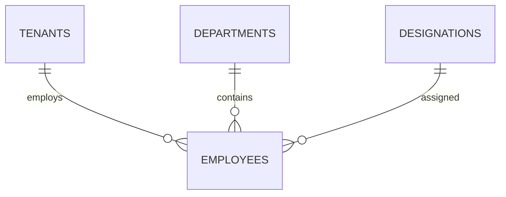

---

## Business Rules

- Every employee belongs to one tenant.
- Employee codes must be unique within a tenant.
- An employee cannot exist without a department.
- An employee cannot exist without a designation.
- Employees cannot be permanently deleted.
- Historical records must remain available.

---

## Recommended Indexes

| Column | Purpose |
|----------|---------|
| tenant_id | Tenant filtering |
| employee_code | Employee search |
| department_id | Department filtering |
| designation_id | Reporting |
| status | Active employees |

---

# 3. Departments Table

## Purpose

Departments organize employees into business units.

Examples:

- Production
- Cutting
- Stitching
- Finishing
- Packing
- Accounts
- HR

---

## Table Structure

| Column | Type | Description |
|----------|------|-------------|
| id | UUID | Primary Key |
| tenant_id | UUID | Factory |
| name | VARCHAR(100) | Department Name |
| description | TEXT | Description |
| created_at | TIMESTAMP | Created |
| updated_at | TIMESTAMP | Updated |

---

## Example Records

| Name |
|------|
| Production |
| Accounts |
| HR |
| Cutting |
| Stitching |
| Finishing |

---

## Relationships

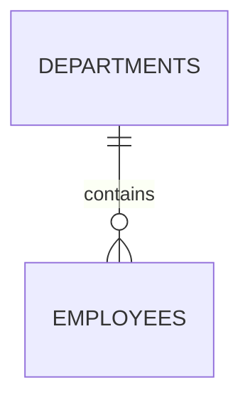

---

## Business Rules

- Department names must be unique within a tenant.
- Departments cannot be deleted while employees are assigned.

---

# 4. Designations Table

## Purpose

Defines job titles for employees.

Examples:

- Factory Manager
- Supervisor
- Cutting Operator
- Stitching Operator
- Accountant
- Helper

---

## Table Structure

| Column | Type | Description |
|----------|------|-------------|
| id | UUID | Primary Key |
| tenant_id | UUID | Factory |
| title | VARCHAR(100) | Designation |
| description | TEXT | Description |
| created_at | TIMESTAMP | Created |
| updated_at | TIMESTAMP | Updated |

---

## Example Records

| Title |
|--------|
| Factory Manager |
| Production Supervisor |
| Stitching Operator |
| Cutting Operator |
| Accountant |

---

## Relationships

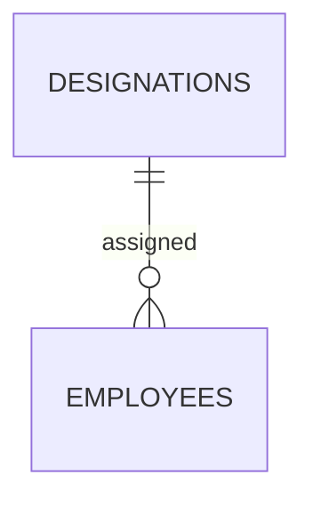

---

## Business Rules

- Designation names must be unique within a tenant.
- Employees must always have one designation.
- Designations can be reused by multiple employees.

---

# 5. Entity Relationship Diagram

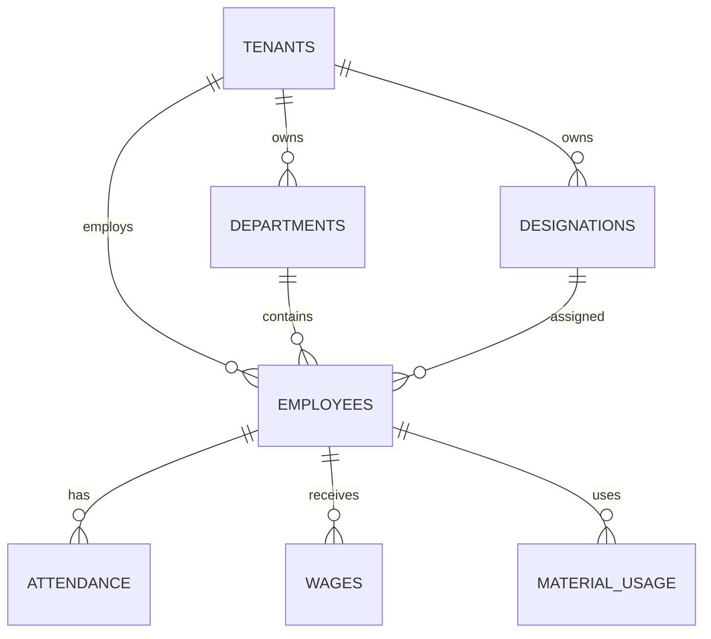

---

# 6. Validation Rules

| Field | Validation |
|---------|------------|
| Employee Code | Required, unique within tenant |
| First Name | Required, max 100 characters |
| Last Name | Required, max 100 characters |
| Phone | Valid phone number |
| Email | Valid email format |
| Salary | Greater than or equal to 0 |
| Hire Date | Cannot be in the future |
| Department | Required |
| Designation | Required |

---

# 7. Future Enhancements

The employee module can later support:

- Emergency Contacts
- Identity Documents
- Bank Details
- Shift Scheduling
- Leave Management
- Performance Reviews
- Skill Matrix
- Certifications
- Payroll Integration
- Employee Portal

These features are intentionally excluded from Version 1 to keep the initial release focused and manageable.

---

# Design Decision

Instead of storing department and designation as plain text in the `employees` table, they are normalized into separate tables.

### Benefits

- Prevents duplicate values (e.g., "HR", "Human Resources", "Hr").
- Makes updates easier—renaming a department only requires changing one record.
- Enables filtering, reporting, and future enhancements (such as department heads or designation hierarchies).

---

# Next Section

# 8. Attendance Management

## Purpose

The Attendance module records the daily attendance of employees and serves as the primary source for payroll calculations, productivity analysis, and reporting.

Attendance records help administrators:

- Monitor employee presence
- Calculate wages accurately
- Analyze workforce productivity
- Generate attendance reports

---

# Attendance Workflow

```mermaid
flowchart LR

Employee

↓

Attendance Record

↓

Payroll Calculation

↓

Wages

↓

Reports
```

---

# 9. Attendance Table

## Purpose

Stores one attendance record per employee per working day.

---

## Table Structure

| Column | Type | Constraints | Description |
|----------|------|------------|-------------|
| id | UUID | PK | Attendance ID |
| tenant_id | UUID | FK | Factory |
| employee_id | UUID | FK | Employee |
| attendance_date | DATE | NOT NULL | Attendance Date |
| status | ENUM | NOT NULL | Attendance Status |
| check_in | TIMESTAMP | NULL | Check-in Time |
| check_out | TIMESTAMP | NULL | Check-out Time |
| overtime_hours | DECIMAL(5,2) | Default 0 | Overtime |
| remarks | TEXT | NULL | Notes |
| created_at | TIMESTAMP | | Created |
| updated_at | TIMESTAMP | | Updated |

---

## Attendance Status

| Status | Description |
|----------|-------------|
| Present | Employee worked |
| Absent | Employee absent |
| Leave | Approved leave |
| Half Day | Worked half shift |
| Holiday | Public holiday |

---

## Example Records

| Employee | Date | Status |
|-----------|------|---------|
| Muhammad Talha | 2026-07-15 | Present |
| Ali | 2026-07-15 | Half Day |
| Ahmed | 2026-07-15 | Leave |

---

## Relationships

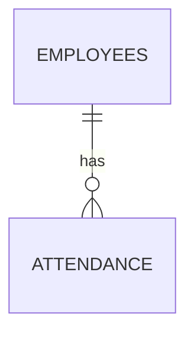

---

## Business Rules

- One attendance record per employee per day.
- Attendance cannot exist without an employee.
- Check-out time must be later than check-in.
- Overtime cannot be negative.
- Attendance history should never be deleted.

---

## Recommended Indexes

| Column | Purpose |
|----------|---------|
| employee_id | Employee history |
| attendance_date | Daily reports |
| tenant_id | Tenant filtering |

---

# Validation Rules

| Field | Rule |
|---------|------|
| Attendance Date | Required |
| Status | Required |
| Check Out | Greater than Check In |
| Overtime | >= 0 |

---

# 10. Wage Management

## Purpose

The Wage module records employee earnings and payment history.

The ERP supports multiple payment methods:

- Daily Wage
- Monthly Salary
- Piece Rate

This design allows factories to pay employees using different compensation models.

---

# Wage Flow

```mermaid
flowchart LR

Attendance

↓

Completed Work

↓

Payroll Calculation

↓

Wages

↓

Payments
```

---

# 11. Wages Table

## Purpose

Stores payroll information for employees.

Each record represents a payment period.

---

## Table Structure

| Column | Type | Constraints | Description |
|----------|------|------------|-------------|
| id | UUID | PK | Wage ID |
| tenant_id | UUID | FK | Factory |
| employee_id | UUID | FK | Employee |
| pay_period_start | DATE | | Start Date |
| pay_period_end | DATE | | End Date |
| salary_type | ENUM | Daily, Monthly, Piece Rate |
| gross_amount | DECIMAL(12,2) | | Gross Wage |
| overtime_amount | DECIMAL(12,2) | Default 0 | Overtime Pay |
| deductions | DECIMAL(12,2) | Default 0 | Deductions |
| advances | DECIMAL(12,2) | Default 0 | Advance Payments |
| net_amount | DECIMAL(12,2) | | Final Payable Amount |
| payment_status | ENUM | Pending, Paid, Partial |
| payment_date | DATE | NULL | Payment Date |
| created_at | TIMESTAMP | | Created |
| updated_at | TIMESTAMP | | Updated |

---

## Example Record

| Employee | Gross | Advance | Net |
|-----------|--------|----------|------|
| Muhammad Talha | 40,000 | 5,000 | 35,000 |
| Ali | 28,000 | 0 | 28,000 |

---

## Relationships

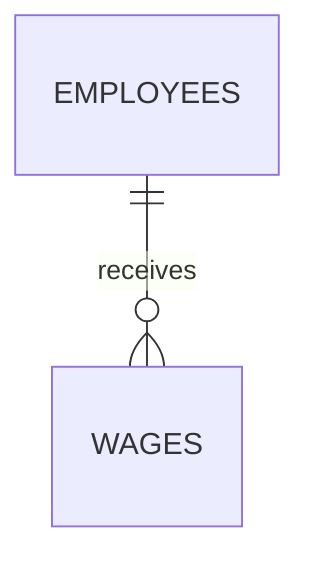

---

## Business Rules

- Wage records cannot exist without an employee.
- Net amount must never be negative.
- Advances reduce the payable amount.
- Paid wages should not be modified without authorization.
- Every wage record belongs to one payment period.

---

## Formula

```text
Net Wage

=

Gross Wage

+

Overtime

-

Deductions

-

Advances
```

Example:

```text
Gross Salary = 40,000

Overtime = 3,000

Deductions = 2,000

Advance = 5,000

Net Salary

=

40,000

+

3,000

-

2,000

-

5,000

=

36,000
```

---

## Payment Status

| Status | Meaning |
|----------|---------|
| Pending | Not paid |
| Partial | Partially paid |
| Paid | Fully paid |

---

## Recommended Indexes

| Column | Purpose |
|----------|---------|
| employee_id | Payroll history |
| payment_status | Pending payments |
| pay_period_start | Payroll reports |
| tenant_id | Tenant filtering |

---

# Validation Rules

| Field | Validation |
|---------|------------|
| Gross Amount | >= 0 |
| Overtime | >= 0 |
| Deductions | >= 0 |
| Advances | >= 0 |
| Net Amount | >= 0 |

---

# Payroll Calculation Logic

```mermaid
flowchart TD

Attendance

-->

Worked Days

-->

Salary Type

-->

Overtime

-->

Deductions

-->

Advances

-->

Net Salary
```

---

# Attendance & Wage ER Diagram

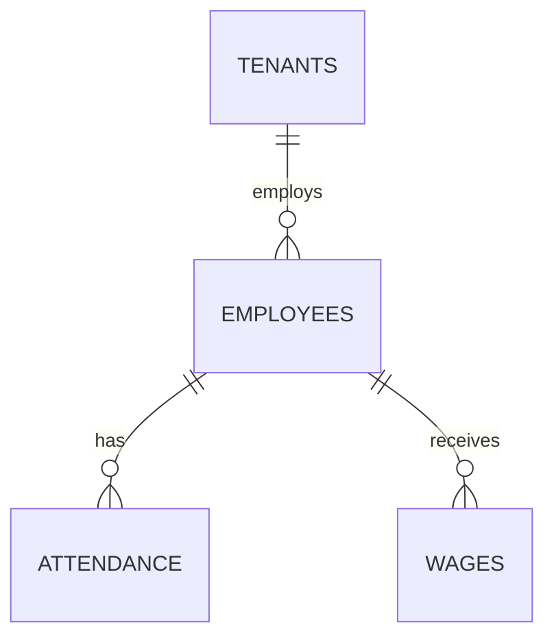

---

# Future Enhancements

The payroll system can later support:

- Automatic payroll generation
- Tax calculations
- Bonuses
- Penalties
- Leave deductions
- Shift allowances
- Night shift pay
- Bank transfers
- Payslip generation
- Payroll approval workflow

These features are intentionally excluded from Version 1 to keep the first release focused and easier to maintain.

---

# Design Decisions

### Why Separate Attendance and Wages?

Attendance and payroll represent different business concepts.

Keeping them in separate tables provides:

- Better normalization
- Independent reporting
- Flexible payroll calculations
- Support for multiple salary types
- Easier future enhancements

---

## Next Section

# 12. Inventory Management

## Purpose

The Inventory Management module is responsible for tracking all raw materials used in production.

It enables factory administrators to:

- Manage raw materials
- Organize materials into categories
- Track stock levels
- Record purchases
- Monitor stock movement
- Prevent inventory shortages
- Calculate inventory costs

This module integrates with:

- Purchase Orders
- Workflow Management
- Daily Material Usage
- Accounts
- Reports

---

# Inventory Module Overview

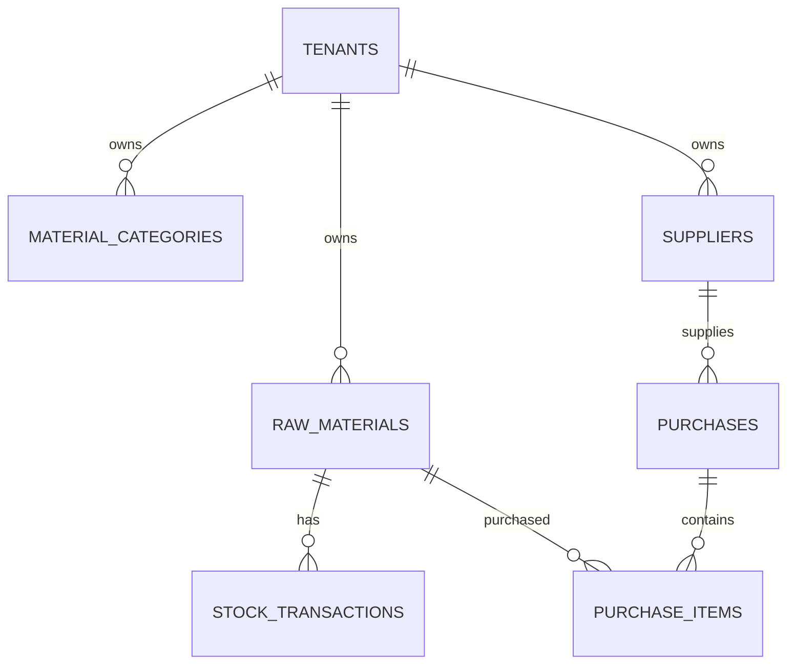

---

# 13. Material Categories Table

## Purpose

Material Categories organize raw materials into logical groups.

Examples:

- Fabric
- Thread
- Buttons
- Zippers
- Packaging
- Labels
- Accessories

---

## Table Structure

| Column | Type | Constraints | Description |
|----------|------|------------|-------------|
| id | UUID | PK | Category ID |
| tenant_id | UUID | FK | Factory |
| name | VARCHAR(100) | UNIQUE (per tenant) | Category Name |
| description | TEXT | NULL | Description |
| created_at | TIMESTAMP | | Created |
| updated_at | TIMESTAMP | | Updated |

---

## Example Records

| Category |
|-----------|
| Fabric |
| Thread |
| Buttons |
| Zippers |
| Labels |

---

## Business Rules

- Category names must be unique.
- Categories cannot be deleted while materials belong to them.

---

# 14. Raw Materials Table

## Purpose

Stores all raw materials available in inventory.

Examples:

- Cotton Fabric
- Blue Thread
- Plastic Buttons
- Metal Zipper

---

## Table Structure

| Column | Type | Constraints | Description |
|----------|------|------------|-------------|
| id | UUID | PK | Material ID |
| tenant_id | UUID | FK | Factory |
| category_id | UUID | FK | Material Category |
| material_code | VARCHAR(30) | UNIQUE (per tenant) | Material Code |
| material_name | VARCHAR(150) | NOT NULL | Material Name |
| unit | ENUM | Meter, Piece, Kg, Roll, Box | Measurement Unit |
| current_stock | DECIMAL(12,2) | Default 0 | Current Quantity |
| minimum_stock | DECIMAL(12,2) | Default 0 | Reorder Level |
| purchase_price | DECIMAL(12,2) | | Cost Price |
| status | ENUM | Active, Inactive | Status |
| created_at | TIMESTAMP | | Created |
| updated_at | TIMESTAMP | | Updated |

---

## Example Record

| Code | Material | Stock | Unit |
|-------|----------|-------|------|
| MAT-001 | Cotton Fabric | 1200 | Meter |
| MAT-002 | Plastic Button | 5000 | Piece |

---

## Business Rules

- Material code must be unique.
- Stock quantity cannot be negative.
- Materials cannot exist without a category.

---

## Recommended Indexes

| Column | Purpose |
|----------|---------|
| tenant_id | Tenant filtering |
| category_id | Category search |
| material_name | Material lookup |
| material_code | Fast search |

---

# 15. Suppliers Table

## Purpose

Stores information about suppliers from whom raw materials are purchased.

---

## Table Structure

| Column | Type | Constraints | Description |
|----------|------|------------|-------------|
| id | UUID | PK | Supplier ID |
| tenant_id | UUID | FK | Factory |
| supplier_name | VARCHAR(150) | NOT NULL | Supplier Name |
| phone | VARCHAR(20) | NULL | Contact Number |
| email | VARCHAR(255) | NULL | Email |
| address | TEXT | NULL | Address |
| city | VARCHAR(100) | NULL | City |
| status | ENUM | Active, Inactive | Status |
| created_at | TIMESTAMP | | Created |
| updated_at | TIMESTAMP | | Updated |

---

## Example Record

| Supplier |
|-----------|
| Faisal Fabrics |
| Textile World |
| Pak Buttons Ltd |

---

## Business Rules

- Suppliers can provide multiple materials.
- Suppliers cannot be deleted if purchase history exists.

---

# 16. Purchases Table

## Purpose

Represents a purchase transaction made from a supplier.

One purchase may contain multiple materials.

---

## Table Structure

| Column | Type | Constraints | Description |
|----------|------|------------|-------------|
| id | UUID | PK | Purchase ID |
| tenant_id | UUID | FK | Factory |
| supplier_id | UUID | FK | Supplier |
| invoice_number | VARCHAR(100) | UNIQUE | Supplier Invoice |
| purchase_date | DATE | | Purchase Date |
| total_amount | DECIMAL(12,2) | | Total Cost |
| payment_status | ENUM | Pending, Partial, Paid | Payment Status |
| remarks | TEXT | NULL | Notes |
| created_at | TIMESTAMP | | Created |

---

## Relationships

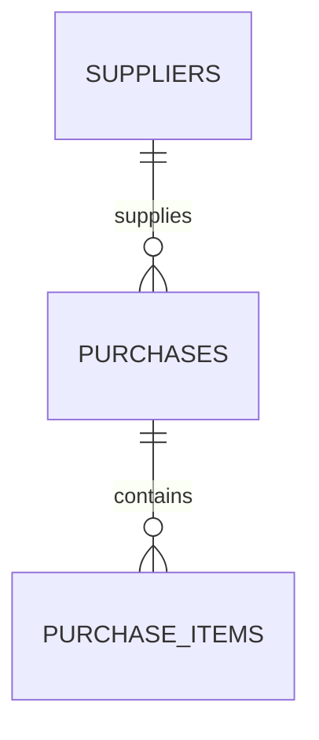

---

# 17. Purchase Items Table

## Purpose

Stores the individual materials included in each purchase.

---

## Table Structure

| Column | Type | Description |
|----------|------|-------------|
| id | UUID | Primary Key |
| purchase_id | UUID | Purchase |
| material_id | UUID | Material |
| quantity | DECIMAL(12,2) | Purchased Quantity |
| unit_price | DECIMAL(12,2) | Cost Per Unit |
| total_price | DECIMAL(12,2) | Line Total |

---

## Formula

```text
Total Price

=

Quantity × Unit Price
```

---

# 18. Stock Transactions Table

## Purpose

Tracks every inventory movement.

Instead of only storing the latest stock quantity, this table keeps the complete inventory history.

---

## Transaction Types

| Type | Description |
|------|-------------|
| Purchase | Stock Added |
| Material Usage | Stock Removed |
| Manual Adjustment | Correction |
| Return | Stock Returned |
| Damage | Stock Reduced |

---

## Table Structure

| Column | Type | Description |
|----------|------|-------------|
| id | UUID | Primary Key |
| tenant_id | UUID | Factory |
| material_id | UUID | Material |
| transaction_type | ENUM | Transaction Type |
| reference_id | UUID | Related Record |
| quantity | DECIMAL(12,2) | Quantity Changed |
| balance_after | DECIMAL(12,2) | Remaining Stock |
| transaction_date | TIMESTAMP | Date |
| created_by | UUID | User |

---

## Inventory Flow

```mermaid
flowchart LR

Supplier

-->

Purchase

-->

Inventory

-->

Daily Usage

-->

Production

-->

Reports
```

---

# Inventory Entity Relationship Diagram

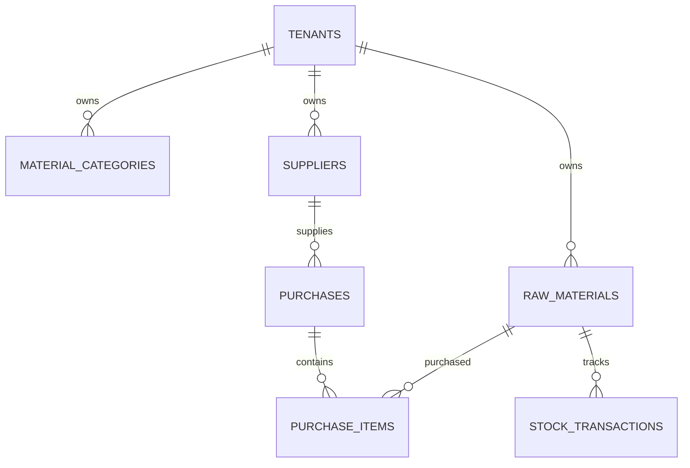

---

# Validation Rules

| Field | Validation |
|---------|------------|
| Material Name | Required |
| Material Code | Unique |
| Purchase Price | >= 0 |
| Stock Quantity | >= 0 |
| Supplier | Required |
| Invoice Number | Unique |
| Purchase Quantity | > 0 |

---

# Business Rules

- Every material belongs to one category.
- Every purchase belongs to one supplier.
- A purchase must contain at least one purchase item.
- Stock cannot become negative.
- Every inventory change must create a stock transaction.
- Deleting purchase history is not allowed.
- Inventory adjustments should be auditable.

---

# Design Decisions

### Why Use a Stock Transactions Table?

Instead of directly updating the stock quantity without history, every inventory movement is recorded.

**Benefits:**

- Complete inventory audit trail
- Easier error investigation
- Accurate reporting
- Supports inventory reconciliation
- Enables future FIFO/LIFO inventory costing

---

# Next Section

# 19. Daily Material Usage

## Purpose

The Daily Material Usage module records how raw materials are consumed during production.

Unlike purchase records, which increase inventory, material usage records decrease inventory based on actual production activities.

This module helps factory managers:

- Track daily material consumption
- Monitor employee productivity
- Calculate production costs
- Reduce material wastage
- Maintain accurate inventory

---

# Material Usage Workflow

```mermaid
flowchart LR

Inventory

-->

Employee

-->

Production Task

-->

Material Usage

-->

Inventory Update

-->

Reports
```

---

# 20. Material Usage Table

## Purpose

Stores every material consumed during production.

Each record represents a single material usage event.

---

## Table Structure

| Column | Type | Constraints | Description |
|---------|------|------------|-------------|
| id | UUID | PK | Usage ID |
| tenant_id | UUID | FK | Factory |
| employee_id | UUID | FK | Employee using the material |
| material_id | UUID | FK | Material |
| workflow_id | UUID | FK | Production Workflow |
| purchase_order_id | UUID | FK | Related Purchase Order |
| usage_date | DATE | NOT NULL | Date of usage |
| quantity_used | DECIMAL(12,2) | NOT NULL | Quantity consumed |
| unit | VARCHAR(20) | NOT NULL | Measurement Unit |
| wastage_quantity | DECIMAL(12,2) | Default 0 | Damaged or wasted material |
| remarks | TEXT | NULL | Additional notes |
| created_at | TIMESTAMP | | Record creation |
| updated_at | TIMESTAMP | | Last update |

---

## Example Records

| Employee | Material | Quantity | Date |
|-----------|----------|---------:|------|
| Ali | Cotton Fabric | 120 m | 2026-07-15 |
| Ahmad | Blue Thread | 18 rolls | 2026-07-15 |
| Sara | Buttons | 250 pcs | 2026-07-15 |

---

# Relationships

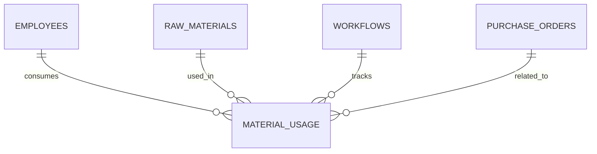

---

# Business Rules

- Material must exist before it can be used.
- Employee must exist.
- Quantity used must be greater than zero.
- Quantity used cannot exceed available stock.
- Every usage record must generate a stock transaction.
- Usage history cannot be deleted.
- Wastage must never exceed quantity used.

---

# Recommended Indexes

| Column | Purpose |
|---------|---------|
| tenant_id | Tenant filtering |
| material_id | Material history |
| employee_id | Employee reports |
| workflow_id | Production reports |
| usage_date | Daily reports |

---

# Validation Rules

| Field | Validation |
|---------|------------|
| Quantity Used | > 0 |
| Wastage | >= 0 |
| Wastage | <= Quantity Used |
| Usage Date | Required |
| Material | Required |
| Employee | Required |

---

# Inventory Deduction Process

Whenever a material usage record is created, inventory should be updated automatically.

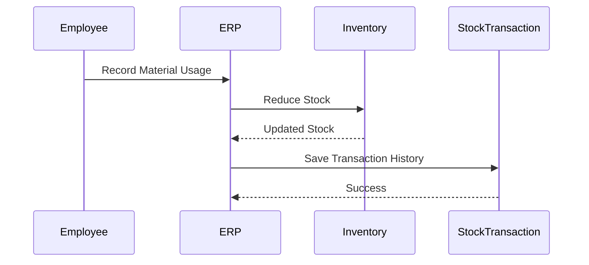

---

# Stock Calculation

```text
Current Stock

=

Previous Stock

-

Quantity Used

-

Wastage
```

### Example

```text
Previous Stock = 1000 meters

Used = 120 meters

Waste = 5 meters

Remaining Stock

=

1000

-

120

-

5

=

875 meters
```

---

# Material Cost Tracking

Each usage record contributes to production cost.

```text
Material Cost

=

Quantity Used

×

Purchase Price
```

Example

```text
Fabric Price = Rs. 350 / meter

Used = 100 meters

Production Cost

=

350 × 100

=

Rs. 35,000
```

This information is useful for:

- Profit calculations
- Purchase Order costing
- Production reports
- Cost analysis

---

# Material Usage Lifecycle

```mermaid
flowchart TD

Purchase

-->

Inventory

-->

Production Assignment

-->

Material Usage

-->

Inventory Updated

-->

Production Completed

-->

Reports
```

---

# Complete Inventory Flow

```mermaid
flowchart LR

Supplier

-->

Purchase

-->

Inventory

-->

Material Usage

-->

Production

-->

Finished Product

-->

Reports
```

---

# Complete Inventory ER Diagram

```mermaid
erDiagram

TENANTS ||--o{ MATERIAL_CATEGORIES : owns

TENANTS ||--o{ RAW_MATERIALS : owns

TENANTS ||--o{ SUPPLIERS : owns

RAW_MATERIALS ||--o{ STOCK_TRANSACTIONS : tracks

RAW_MATERIALS ||--o{ MATERIAL_USAGE : consumed

SUPPLIERS ||--o{ PURCHASES : supplies

PURCHASES ||--o{ PURCHASE_ITEMS : contains

EMPLOYEES ||--o{ MATERIAL_USAGE : uses

WORKFLOWS ||--o{ MATERIAL_USAGE : records
```

---

# Reporting Examples

The database should support reports such as:

### Daily Material Consumption

| Material | Used |
|----------|------:|
| Cotton Fabric | 540 m |
| Thread | 42 Rolls |
| Buttons | 3,200 pcs |

---

### Employee Consumption

| Employee | Material Used |
|-----------|---------------|
| Ali | 240 m Fabric |
| Ahmad | 18 Rolls Thread |
| Sara | 500 Buttons |

---

### Material Wastage

| Material | Wastage |
|----------|---------:|
| Fabric | 12 m |
| Thread | 2 Rolls |

---

### Low Stock Report

| Material | Remaining |
|----------|-----------:|
| Cotton Fabric | 80 m |
| Blue Thread | 5 Rolls |

---

# Design Decisions

## Why Store Usage Separately?

Material usage is separated from inventory because inventory represents the **current stock**, while material usage represents the **history of consumption**.

This design provides:

- Complete audit trail
- Accurate production costing
- Employee productivity analysis
- Material wastage tracking
- Historical reporting

---

# Summary

At this stage, the Inventory module includes:

- ✅ Material Categories
- ✅ Raw Materials
- ✅ Suppliers
- ✅ Purchases
- ✅ Purchase Items
- ✅ Stock Transactions
- ✅ Daily Material Usage

These tables provide complete inventory lifecycle management—from purchasing raw materials to tracking their consumption in production.

---
