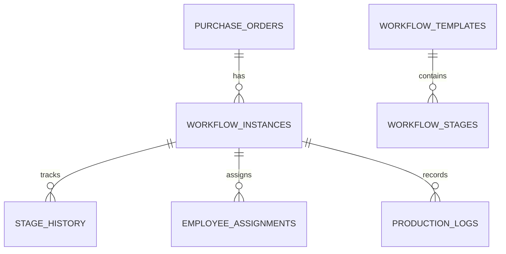
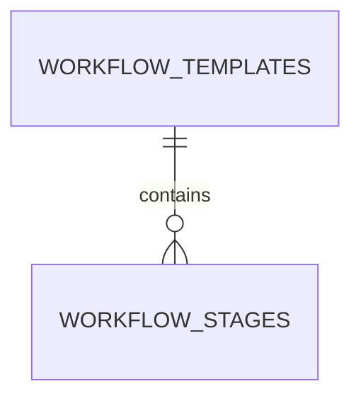
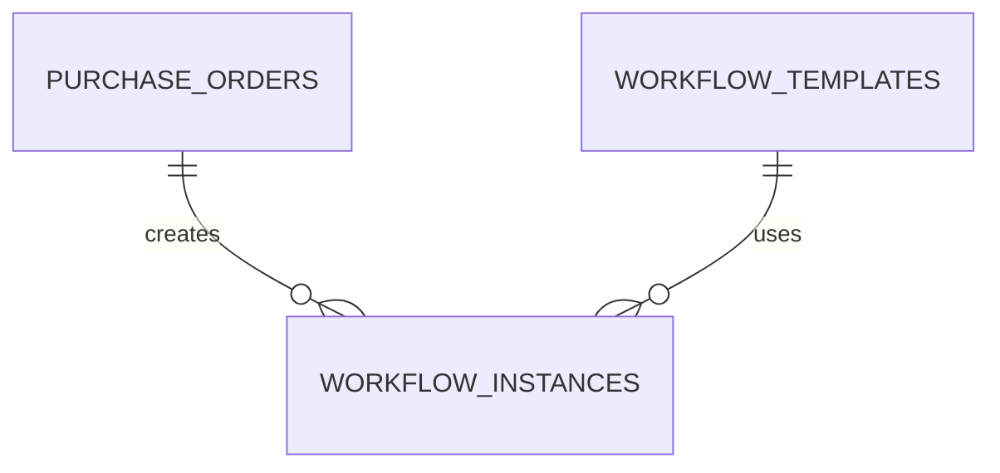
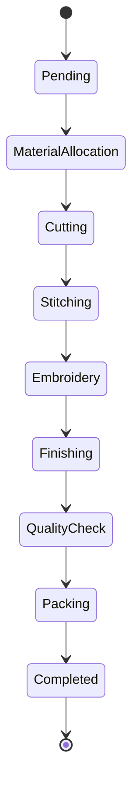
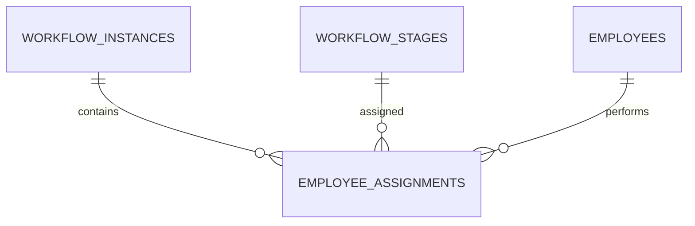
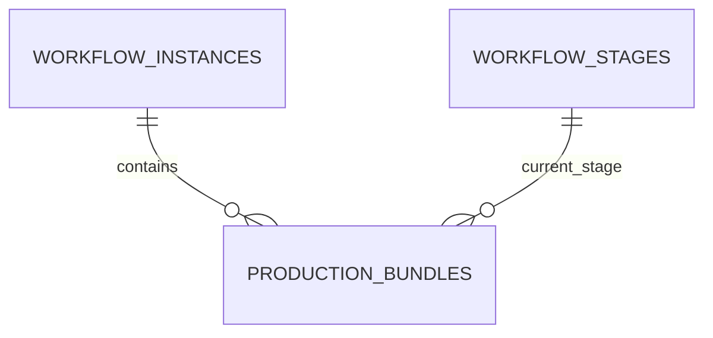
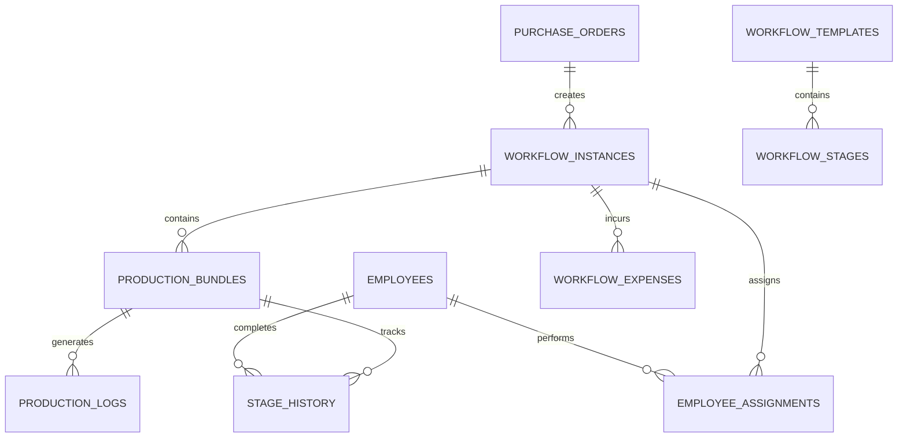

# Database Design (Part 3)

**Project Name:** Factory Management System (ERP)

**Document Version:** 1.0

---

# Table of Contents

1. Production Workflow Overview
2. Workflow Templates
3. Workflow Stages
4. Purchase Order Workflow
5. Employee Assignments
6. Bundle Tracking
7. Production Logs
8. Workflow Expenses
9. Kanban Board
10. Business Rules
11. Validation Rules

---

# 1. Production Workflow Overview

## Purpose

The Production Workflow module manages the complete manufacturing lifecycle of a Purchase Order.

Instead of simply marking a Purchase Order as **Pending** or **Completed**, the ERP tracks every production stage independently.

This provides:

- Real-time production tracking
- Employee accountability
- Stage-wise progress
- Material consumption tracking
- Production reports
- Delay analysis

---

# Manufacturing Flow

```mermaid
flowchart LR

Customer

-->

Purchase Order

-->

Material Allocation

-->

Cutting

-->

Stitching

-->

Embroidery

-->

Finishing

-->

Quality Check

-->

Packing

-->

Completed
```

---

# Why Workflow Management?

Consider a customer ordering **5,000 polo shirts**.

Without workflows:

```
Status

Pending

↓

Completed
```

No one knows:

- What stage production is in
- Who is responsible
- Whether production is delayed

---

With workflows:

```
Purchase Order

↓

Material Allocation

↓

Cutting

↓

Stitching

↓

Printing

↓

Finishing

↓

Quality Check

↓

Packing

↓

Completed
```

Every stage is monitored independently.

---

# Workflow Architecture



---

# 2. Workflow Templates

## Purpose

A Workflow Template defines the standard production process for a product.

Example:

### Polo Shirt

```
Material Allocation

↓

Cutting

↓

Stitching

↓

Printing

↓

Quality Check

↓

Packing
```

---

### Hoodie

```
Material Allocation

↓

Cutting

↓

Embroidery

↓

Stitching

↓

Finishing

↓

Packing
```

Different products can follow different workflows.

---

## Table Structure

| Column | Type | Description |
|----------|------|-------------|
| id | UUID | Primary Key |
| tenant_id | UUID | Factory |
| template_name | VARCHAR(150) | Workflow Name |
| description | TEXT | Description |
| is_active | BOOLEAN | Active Template |
| created_at | TIMESTAMP | Created |
| updated_at | TIMESTAMP | Updated |

---

## Example Records

| Template |
|-----------|
| Polo Shirt Production |
| Hoodie Workflow |
| Uniform Workflow |

---

## Business Rules

- Template names must be unique within a tenant.
- Templates cannot be deleted if they are used by active workflows.
- Templates can be archived instead of deleted.

---

# 3. Workflow Stages

## Purpose

Defines the individual stages within a workflow template.

---

## Table Structure

| Column | Type | Description |
|----------|------|-------------|
| id | UUID | Primary Key |
| workflow_template_id | UUID | Template |
| stage_name | VARCHAR(100) | Stage |
| stage_order | INTEGER | Execution Order |
| estimated_hours | DECIMAL | Estimated Time |
| is_required | BOOLEAN | Mandatory Stage |
| created_at | TIMESTAMP | Created |

---

## Example

| Order | Stage |
|-------:|-------|
| 1 | Material Allocation |
| 2 | Cutting |
| 3 | Stitching |
| 4 | Embroidery |
| 5 | Finishing |
| 6 | Quality Check |
| 7 | Packing |

---

## Relationships



---

## Business Rules

- Stage order must be unique.
- Stage numbers cannot skip.
- Required stages cannot be removed.
- Workflow execution follows stage order.

---

# 4. Workflow Instances

## Purpose

A Workflow Instance is created whenever a Purchase Order is approved.

Think of it as a "live" copy of a workflow template.

Example:

Workflow Template:

```
Cutting

↓

Stitching

↓

Packing
```

Purchase Order #1001

↓

Workflow Instance

↓

Tracks actual production

---

## Table Structure

| Column | Type | Description |
|----------|------|-------------|
| id | UUID | Primary Key |
| tenant_id | UUID | Factory |
| purchase_order_id | UUID | Purchase Order |
| workflow_template_id | UUID | Template |
| current_stage_id | UUID | Active Stage |
| status | ENUM | Pending, In Progress, Completed, Cancelled |
| started_at | TIMESTAMP | Start Time |
| completed_at | TIMESTAMP | Completion Time |

---

## Relationships



---

## Example

| Purchase Order | Current Stage |
|---------------|---------------|
| PO-1001 | Stitching |
| PO-1002 | Quality Check |

---

## Business Rules

- One active workflow per Purchase Order.
- Workflow starts after PO approval.
- Completed workflows cannot move backward.
- Cancelled workflows become read-only.

---

# Workflow Lifecycle



---

# Design Decisions

## Why Templates and Instances?

Separating templates from instances provides flexibility.

Template:

```
Blueprint
```

Instance:

```
Real production process
```

Advantages:

- Reusable workflows
- Product-specific workflows
- Historical workflow tracking
- Easy process updates

---

# Next Section

# 5. Employee Assignments

## Purpose

The Employee Assignments table links employees to specific workflow stages.

Instead of assigning an employee to an entire Purchase Order, employees are assigned to individual production stages.

This enables:

- Better workload distribution
- Productivity tracking
- Employee performance analysis
- Stage ownership
- Accountability

---

## Workflow Example

```text
Purchase Order #PO-1001

↓

Cutting
      ↓
      Ali

↓

Stitching
      ↓
      Ahmed

↓

Embroidery
      ↓
      Sara

↓

Quality Check
      ↓
      Fatima
```

---

## Table Structure

| Column | Type | Description |
|---------|------|-------------|
| id | UUID | Primary Key |
| tenant_id | UUID | Factory |
| workflow_instance_id | UUID | Workflow Instance |
| workflow_stage_id | UUID | Workflow Stage |
| employee_id | UUID | Assigned Employee |
| assigned_at | TIMESTAMP | Assignment Time |
| started_at | TIMESTAMP | Work Started |
| completed_at | TIMESTAMP | Work Completed |
| assignment_status | ENUM | Pending, Working, Completed |
| remarks | TEXT | Notes |

---

## Relationships



---

## Business Rules

- One assignment belongs to one workflow stage.
- Multiple employees may work on the same stage.
- An employee cannot have duplicate active assignments for the same stage.
- Assignment status updates automatically based on progress.

---

# 6. Production Bundles

## Purpose

Factories rarely move an entire order through production at once.

Instead, they divide large orders into smaller bundles.

Example:

Purchase Order

```
5,000 Shirts
```

↓

Bundles

```
Bundle A → 500

Bundle B → 500

Bundle C → 500

...

Bundle J → 500
```

Each bundle progresses independently.

---

## Benefits

- Faster production tracking
- Easier workload balancing
- Better quality control
- Simplified issue isolation

---

## Table Structure

| Column | Type | Description |
|---------|------|-------------|
| id | UUID | Primary Key |
| tenant_id | UUID | Factory |
| workflow_instance_id | UUID | Workflow |
| bundle_number | VARCHAR(50) | Bundle Identifier |
| quantity | INTEGER | Items in Bundle |
| current_stage_id | UUID | Current Stage |
| status | ENUM | Pending, In Progress, Completed |
| created_at | TIMESTAMP | Creation Time |

---

## Example Records

| Bundle | Quantity | Current Stage |
|---------|---------:|---------------|
| B001 | 500 | Cutting |
| B002 | 500 | Stitching |
| B003 | 500 | Packing |

---

## Relationships



---

## Business Rules

- Bundle quantity must be greater than zero.
- Bundle numbers must be unique within a workflow.
- A completed bundle cannot move backward.
- Every bundle belongs to one workflow instance.

---

# 7. Stage History

## Purpose

Every stage transition should be recorded.

This creates a complete production history.

---

## Example

```text
Bundle B001

↓

Material Allocation

↓

Cutting

↓

Stitching

↓

Quality Check

↓

Packing

↓

Completed
```

---

## Table Structure

| Column | Type | Description |
|---------|------|-------------|
| id | UUID | Primary Key |
| bundle_id | UUID | Production Bundle |
| stage_id | UUID | Workflow Stage |
| employee_id | UUID | Completed By |
| started_at | TIMESTAMP | Start Time |
| completed_at | TIMESTAMP | Finish Time |
| duration_minutes | INTEGER | Total Duration |
| remarks | TEXT | Notes |

---

## Business Rules

- History cannot be modified after completion.
- Every stage transition creates one history record.
- Duration is calculated automatically.

---

# 8. Production Logs

## Purpose

Production logs capture operational events during manufacturing.

Examples:

- Production started
- Production paused
- Machine breakdown
- Material shortage
- Quality issue
- Bundle completed

---

## Table Structure

| Column | Type | Description |
|---------|------|-------------|
| id | UUID | Primary Key |
| tenant_id | UUID | Factory |
| workflow_instance_id | UUID | Workflow |
| bundle_id | UUID | Bundle |
| employee_id | UUID | Employee |
| log_type | ENUM | Event Type |
| message | TEXT | Event Description |
| created_at | TIMESTAMP | Event Time |

---

## Example Logs

| Time | Event |
|------|-------|
| 08:00 | Bundle Started |
| 09:15 | Material Shortage |
| 10:05 | Material Received |
| 12:30 | Cutting Completed |

---

# 9. Workflow Expenses

## Purpose

Tracks production-related expenses that are not part of raw material costs.

Examples:

- Machine maintenance
- Electricity
- Packaging
- Transportation
- Outsourcing
- Miscellaneous

---

## Table Structure

| Column | Type | Description |
|---------|------|-------------|
| id | UUID | Primary Key |
| workflow_instance_id | UUID | Workflow |
| expense_type | VARCHAR(100) | Expense Category |
| amount | DECIMAL(12,2) | Expense Amount |
| description | TEXT | Notes |
| expense_date | DATE | Date |

---

## Example Records

| Expense | Amount |
|----------|-------:|
| Electricity | 12,500 |
| Packaging | 8,000 |
| Machine Repair | 25,000 |

---

# 10. Complete Production ER Diagram



---

# 11. Production Workflow Lifecycle

```mermaid
flowchart LR

PurchaseOrder

-->

Workflow

-->

Bundle

-->

Employee Assignment

-->

Production

-->

Stage Completion

-->

Quality Check

-->

Packing

-->

Completed
```

---

# 12. Design Decisions

## Why Use Production Bundles?

Large orders become easier to manage when split into smaller units.

Advantages:

- Parallel production
- Faster completion
- Easier quality inspection
- Better employee tracking
- Improved reporting

---

## Why Record Stage History?

Instead of storing only the current stage, historical data provides:

- Production timelines
- Delay analysis
- Employee performance metrics
- Audit trails
- Process improvement opportunities

---

## Summary

The Production module now supports:

- ✅ Workflow Templates
- ✅ Workflow Stages
- ✅ Workflow Instances
- ✅ Employee Assignments
- ✅ Production Bundles
- ✅ Stage History
- ✅ Production Logs
- ✅ Workflow Expenses

This design enables end-to-end production tracking from Purchase Order creation to final completion while maintaining detailed operational history and supporting future analytics.

---

# Next Document

**`04_Database_Design_Part4.md`**

The next part will cover:

- Customer Management
- Purchase Orders
- Purchase Order Items
- Accounts
- Revenue
- Expenses
- Transactions
- Financial Reports
- Profit & Loss
- Financial ER Diagram