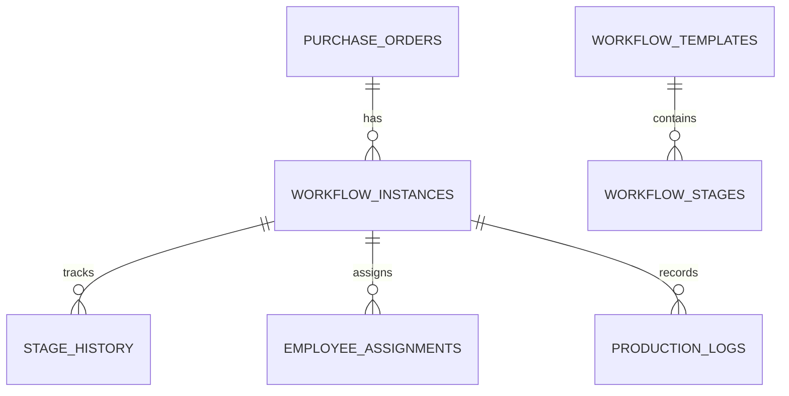
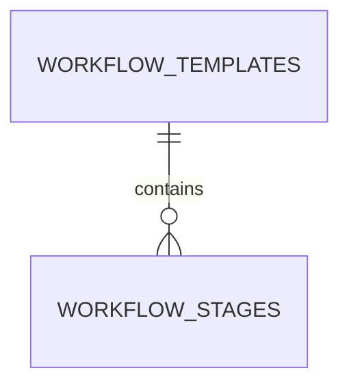
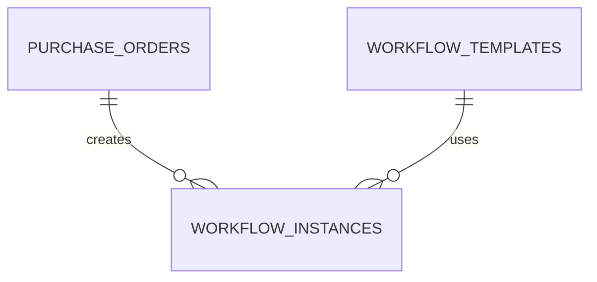
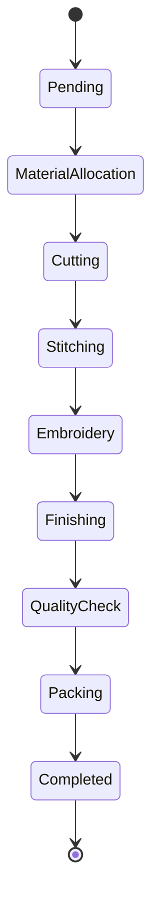

# Database Design (Part 3)

**Project Name:** Factory Management System (ERP)

**Document Version:** 1.0

---

# Table of Contents

1. Production Workflow Overview
2. Workflow Templates
3. Workflow Stages
4. Purchase Order Workflow
5. Employee Assignments
6. Bundle Tracking
7. Production Logs
8. Workflow Expenses
9. Kanban Board
10. Business Rules
11. Validation Rules

---

# 1. Production Workflow Overview

## Purpose

The Production Workflow module manages the complete manufacturing lifecycle of a Purchase Order.

Instead of simply marking a Purchase Order as **Pending** or **Completed**, the ERP tracks every production stage independently.

This provides:

- Real-time production tracking
- Employee accountability
- Stage-wise progress
- Material consumption tracking
- Production reports
- Delay analysis

---

# Manufacturing Flow

```mermaid
flowchart LR

Customer

-->

Purchase Order

-->

Material Allocation

-->

Cutting

-->

Stitching

-->

Embroidery

-->

Finishing

-->

Quality Check

-->

Packing

-->

Completed
```

---

# Why Workflow Management?

Consider a customer ordering **5,000 polo shirts**.

Without workflows:

```
Status

Pending

↓

Completed
```

No one knows:

- What stage production is in
- Who is responsible
- Whether production is delayed

---

With workflows:

```
Purchase Order

↓

Material Allocation

↓

Cutting

↓

Stitching

↓

Printing

↓

Finishing

↓

Quality Check

↓

Packing

↓

Completed
```

Every stage is monitored independently.

---

# Workflow Architecture



---

# 2. Workflow Templates

## Purpose

A Workflow Template defines the standard production process for a product.

Example:

### Polo Shirt

```
Material Allocation

↓

Cutting

↓

Stitching

↓

Printing

↓

Quality Check

↓

Packing
```

---

### Hoodie

```
Material Allocation

↓

Cutting

↓

Embroidery

↓

Stitching

↓

Finishing

↓

Packing
```

Different products can follow different workflows.

---

## Table Structure

| Column | Type | Description |
|----------|------|-------------|
| id | UUID | Primary Key |
| tenant_id | UUID | Factory |
| template_name | VARCHAR(150) | Workflow Name |
| description | TEXT | Description |
| is_active | BOOLEAN | Active Template |
| created_at | TIMESTAMP | Created |
| updated_at | TIMESTAMP | Updated |

---

## Example Records

| Template |
|-----------|
| Polo Shirt Production |
| Hoodie Workflow |
| Uniform Workflow |

---

## Business Rules

- Template names must be unique within a tenant.
- Templates cannot be deleted if they are used by active workflows.
- Templates can be archived instead of deleted.

---

# 3. Workflow Stages

## Purpose

Defines the individual stages within a workflow template.

---

## Table Structure

| Column | Type | Description |
|----------|------|-------------|
| id | UUID | Primary Key |
| workflow_template_id | UUID | Template |
| stage_name | VARCHAR(100) | Stage |
| stage_order | INTEGER | Execution Order |
| estimated_hours | DECIMAL | Estimated Time |
| is_required | BOOLEAN | Mandatory Stage |
| created_at | TIMESTAMP | Created |

---

## Example

| Order | Stage |
|-------:|-------|
| 1 | Material Allocation |
| 2 | Cutting |
| 3 | Stitching |
| 4 | Embroidery |
| 5 | Finishing |
| 6 | Quality Check |
| 7 | Packing |

---

## Relationships



---

## Business Rules

- Stage order must be unique.
- Stage numbers cannot skip.
- Required stages cannot be removed.
- Workflow execution follows stage order.

---

# 4. Workflow Instances

## Purpose

A Workflow Instance is created whenever a Purchase Order is approved.

Think of it as a "live" copy of a workflow template.

Example:

Workflow Template:

```
Cutting

↓

Stitching

↓

Packing
```

Purchase Order #1001

↓

Workflow Instance

↓

Tracks actual production

---

## Table Structure

| Column | Type | Description |
|----------|------|-------------|
| id | UUID | Primary Key |
| tenant_id | UUID | Factory |
| purchase_order_id | UUID | Purchase Order |
| workflow_template_id | UUID | Template |
| current_stage_id | UUID | Active Stage |
| status | ENUM | Pending, In Progress, Completed, Cancelled |
| started_at | TIMESTAMP | Start Time |
| completed_at | TIMESTAMP | Completion Time |

---

## Relationships



---

## Example

| Purchase Order | Current Stage |
|---------------|---------------|
| PO-1001 | Stitching |
| PO-1002 | Quality Check |

---

## Business Rules

- One active workflow per Purchase Order.
- Workflow starts after PO approval.
- Completed workflows cannot move backward.
- Cancelled workflows become read-only.

---

# Workflow Lifecycle



---

# Design Decisions

## Why Templates and Instances?

Separating templates from instances provides flexibility.

Template:

```
Blueprint
```

Instance:

```
Real production process
```

Advantages:

- Reusable workflows
- Product-specific workflows
- Historical workflow tracking
- Easy process updates

---

# Next Section

The next section will cover:

- Employee Assignments
- Bundle Tracking
- Stage History
- Production Logs
- Workflow Expenses
- Kanban Board
- Complete Production ER Diagram