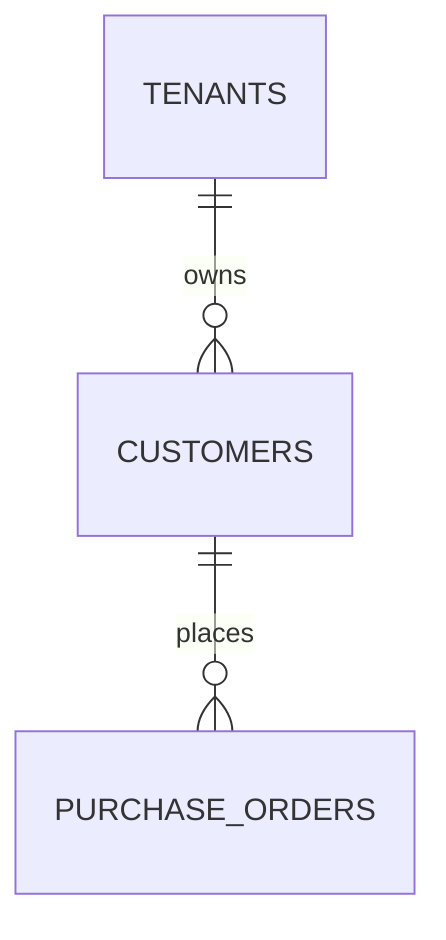
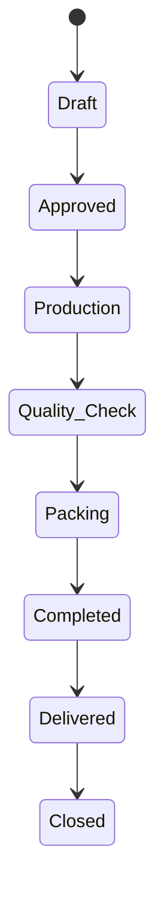
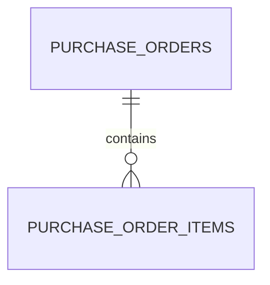
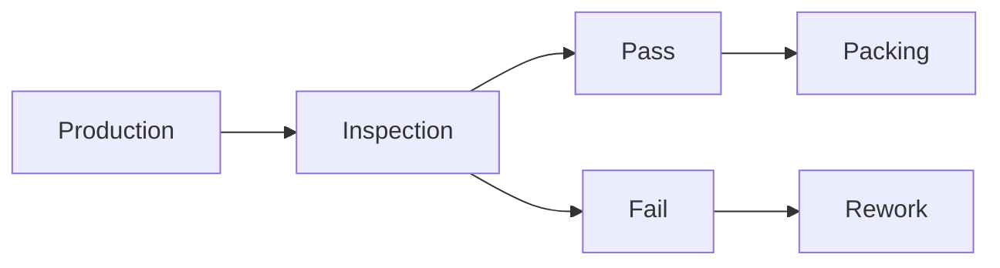
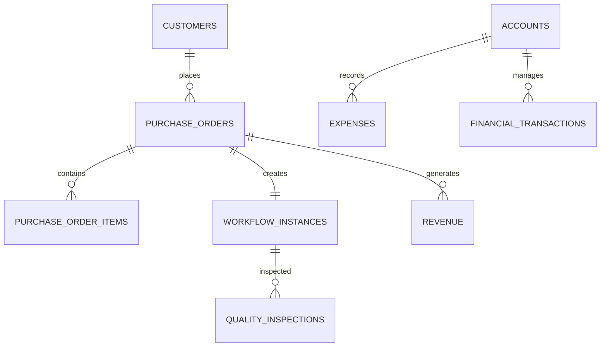

# Database Design (Part 4)

**Project Name:** Factory Management System (ERP)

**Document Version:** 1.0

---

# Table of Contents

1. Customer Management
2. Purchase Orders
3. Purchase Order Items
4. Quality Inspections
5. Financial Transactions
6. Accounts
7. Expenses
8. Revenue
9. Reports
10. Business Rules
11. Validation Rules

---

# 1. Customer Management

## Purpose

The Customers module stores information about clients who place orders with the factory.

Each customer may place multiple purchase orders over time.

This information is used for:

- Order management
- Customer history
- Sales reports
- Financial reports
- Communication

---

# Customer Relationship



---

# 2. Customers Table

## Table Structure

| Column | Type | Description |
|----------|------|-------------|
| id | UUID | Primary Key |
| tenant_id | UUID | Factory |
| customer_code | VARCHAR(30) | Unique Customer Code |
| company_name | VARCHAR(150) | Customer Name |
| contact_person | VARCHAR(100) | Contact Person |
| phone | VARCHAR(20) | Phone |
| email | VARCHAR(255) | Email |
| address | TEXT | Address |
| city | VARCHAR(100) | City |
| country | VARCHAR(100) | Country |
| status | ENUM | Active / Inactive |
| created_at | TIMESTAMP | Created |
| updated_at | TIMESTAMP | Updated |

---

## Example

| Customer |
|-----------|
| Adidas |
| Nike |
| Puma |
| Outfitters |

---

## Business Rules

- Customer code must be unique.
- Customers cannot be deleted if purchase orders exist.

---

# 3. Purchase Orders

## Purpose

Purchase Orders are the heart of the ERP.

Every production workflow starts from a Purchase Order.

---

# Purchase Order Lifecycle



---

## Purchase Orders Table

| Column | Type | Description |
|---------|------|-------------|
| id | UUID | Primary Key |
| tenant_id | UUID | Factory |
| customer_id | UUID | Customer |
| po_number | VARCHAR(50) | Purchase Order Number |
| order_date | DATE | Order Date |
| delivery_date | DATE | Expected Delivery |
| total_quantity | INTEGER | Quantity |
| total_amount | DECIMAL | Order Value |
| workflow_instance_id | UUID | Production Workflow |
| status | ENUM | Draft, Approved, Production, Completed, Delivered |
| remarks | TEXT | Notes |
| created_at | TIMESTAMP | Created |

---

## Example

| PO | Customer | Quantity |
|----|----------|---------:|
| PO-1001 | Adidas | 5000 |
| PO-1002 | Nike | 2500 |

---

## Business Rules

- Every Purchase Order belongs to one customer.
- Every Purchase Order generates one workflow instance.
- PO Number must be unique.
- Completed orders become read-only.

---

# 4. Purchase Order Items

## Purpose

A Purchase Order may contain multiple products.

---

## Table Structure

| Column | Type | Description |
|---------|------|-------------|
| id | UUID | Primary Key |
| purchase_order_id | UUID | Purchase Order |
| product_name | VARCHAR(150) | Product |
| color | VARCHAR(50) | Color |
| size | VARCHAR(20) | Size |
| quantity | INTEGER | Quantity |
| unit_price | DECIMAL | Unit Price |
| total_price | DECIMAL | Total |

---

## Formula

```text
Total Price

=

Quantity × Unit Price
```

---

# Relationships



---

# 5. Quality Inspections

## Purpose

Quality inspections ensure products meet customer requirements before shipment.

---

## Table Structure

| Column | Type | Description |
|----------|------|-------------|
| id | UUID | Primary Key |
| workflow_instance_id | UUID | Workflow |
| inspector_id | UUID | Employee |
| inspection_date | DATE | Inspection Date |
| status | ENUM | Pass / Fail |
| defects_found | INTEGER | Number of Defects |
| rework_required | BOOLEAN | Rework |
| notes | TEXT | Inspector Notes |

---

## Example

| Bundle | Status |
|---------|--------|
| B001 | Pass |
| B002 | Fail |

---

## Business Rules

- Inspection required before packing.
- Failed bundles return to production.
- Every completed workflow requires inspection.

---

# Inspection Flow



---

# 6. Financial Transactions

## Purpose

Stores every money movement in the ERP.

Examples:

- Customer Payments
- Supplier Payments
- Expenses
- Revenue

---

## Table Structure

| Column | Type | Description |
|----------|------|-------------|
| id | UUID | Primary Key |
| tenant_id | UUID | Factory |
| transaction_type | ENUM | Income / Expense |
| reference_type | VARCHAR(100) | Purchase Order, Purchase |
| reference_id | UUID | Related Record |
| amount | DECIMAL | Amount |
| transaction_date | DATE | Date |
| description | TEXT | Notes |

---

# 7. Accounts

## Purpose

Represents account heads used for bookkeeping.

Examples

- Cash
- Bank
- Sales
- Purchases
- Utilities
- Salaries

---

## Accounts Table

| Column | Type | Description |
|----------|------|-------------|
| id | UUID | Primary Key |
| tenant_id | UUID | Factory |
| account_name | VARCHAR(150) | Account |
| account_type | ENUM | Asset, Liability, Income, Expense |
| balance | DECIMAL | Current Balance |

---

# 8. Expenses

## Purpose

Stores operational expenses.

Examples

- Electricity
- Internet
- Fuel
- Salaries
- Rent
- Maintenance

---

## Expenses Table

| Column | Type | Description |
|---------|------|-------------|
| id | UUID | Primary Key |
| tenant_id | UUID | Factory |
| account_id | UUID | Account |
| expense_type | VARCHAR(100) | Type |
| amount | DECIMAL | Amount |
| expense_date | DATE | Date |
| description | TEXT | Notes |

---

# 9. Revenue

## Purpose

Stores revenue generated from completed Purchase Orders.

---

## Revenue Table

| Column | Type | Description |
|----------|------|-------------|
| id | UUID | Primary Key |
| tenant_id | UUID | Factory |
| purchase_order_id | UUID | Purchase Order |
| amount | DECIMAL | Revenue |
| payment_status | ENUM | Pending, Partial, Paid |
| payment_date | DATE | Payment Date |

---

# Financial ER Diagram



---

# Validation Rules

| Field | Validation |
|---------|------------|
| PO Number | Unique |
| Delivery Date | After Order Date |
| Quantity | > 0 |
| Amount | >= 0 |
| Payment | >= 0 |

---

# Business Rules

- Purchase Orders require at least one item.
- Quality inspection is mandatory before packing.
- Revenue is recorded after delivery.
- Expenses must reference an account.
- Financial transactions cannot be deleted.
- Completed Purchase Orders become read-only.

---

# Reports Supported

The database should support reports such as:

- Customer Order History
- Purchase Order Status
- Daily Revenue
- Monthly Expenses
- Profit & Loss
- Outstanding Payments
- Customer Balance
- Production Cost Analysis
- Quality Inspection Report
- Financial Summary

---

# Design Decisions

## Why Separate Revenue and Financial Transactions?

Revenue represents **business income**, while Financial Transactions represent **all money movements** (income and expenses).

Keeping them separate provides:

- Better accounting structure
- Easier reporting
- Audit compliance
- Support for future double-entry bookkeeping

---

# Summary

The Financial module now supports:

- ✅ Customers
- ✅ Purchase Orders
- ✅ Purchase Order Items
- ✅ Quality Inspections
- ✅ Accounts
- ✅ Expenses
- ✅ Revenue
- ✅ Financial Transactions

Together with the previous parts, the ERP now covers the complete business lifecycle:

Customer → Purchase Order → Production → Quality Check → Delivery → Revenue → Financial Reporting

---

# Next Document

**`04_Database_Design_Part5.md`**
