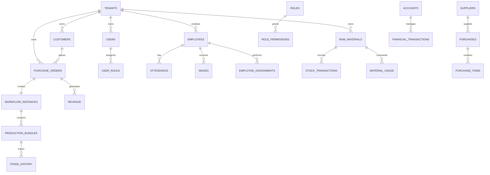

# Database Design (Part 5)

**Project Name:** Factory Management System (ERP)

**Document Version:** 1.0

---

# Table of Contents

1. Complete Database Architecture
2. Complete ER Diagram
3. Indexing Strategy
4. Database Constraints
5. Views
6. Triggers
7. Stored Procedures
8. Transactions
9. Backup Strategy
10. Performance Optimization
11. Security Best Practices
12. Migration Strategy
13. Data Dictionary
14. Final Summary

---

# 1. Complete Database Architecture

The Factory Management System follows a modular database architecture.

```mermaid
flowchart TD

Tenant

-->

Users

-->

Employees

-->

Attendance

-->

Wages

-->

Purchase Orders

-->

Production Workflow

-->

Inventory

-->

Accounts

-->

Reports
```

Each module is independent but connected through foreign keys.

---

# 2. Complete Database ER Diagram



---

# 3. Indexing Strategy

Indexes improve query performance for frequently accessed data.

## Recommended Indexes

| Table | Column(s) |
|---------|-----------|
| users | email |
| users | tenant_id |
| employees | employee_code |
| employees | tenant_id |
| attendance | employee_id, attendance_date |
| wages | employee_id |
| purchase_orders | po_number |
| purchase_orders | customer_id |
| raw_materials | material_code |
| stock_transactions | material_id |
| production_bundles | workflow_instance_id |
| financial_transactions | transaction_date |

---

## Composite Indexes

Use composite indexes for commonly filtered columns.

Example:

```sql
(tenant_id, status)

(tenant_id, created_at)

(employee_id, attendance_date)
```

---

# 4. Database Constraints

## Primary Keys

Every table uses

```text
UUID
```

---

## Foreign Keys

Every relationship is enforced through foreign keys.

Example

```
employee_id

tenant_id

purchase_order_id

workflow_instance_id
```

---

## Unique Constraints

Examples

```
email

company_code

employee_code

po_number

material_code
```

---

## Check Constraints

Examples

```
salary >= 0

quantity >= 0

price >= 0

wastage <= quantity_used
```

---

# 5. Database Views

Views simplify reporting and dashboard development.

## Recommended Views

| View | Purpose |
|------|----------|
| employee_summary | Employee information |
| attendance_summary | Attendance report |
| inventory_summary | Current stock |
| purchase_order_summary | Order progress |
| production_summary | Workflow progress |
| financial_summary | Income vs Expenses |
| dashboard_summary | Dashboard metrics |

---

## Example

```sql
CREATE VIEW inventory_summary AS

SELECT

material_name,

current_stock

FROM raw_materials;
```

---

# 6. Database Triggers

Triggers automate repetitive tasks.

## Recommended Triggers

### Update Timestamp

Whenever a record changes

↓

Update

```
updated_at
```

---

### Material Usage

Material Used

↓

Reduce Inventory

↓

Create Stock Transaction

---

### Purchase Created

Purchase

↓

Increase Inventory

↓

Create Transaction

---

### Attendance

Attendance Saved

↓

Update Payroll

---

### Audit Log

Insert

↓

Update

↓

Delete

↓

Audit Record

---

# Trigger Flow

```mermaid
flowchart LR

Insert

-->

Trigger

-->

Business Logic

-->

Database Update
```

---

# 7. Stored Procedures

Stored procedures simplify complex operations.

Recommended procedures:

| Procedure | Purpose |
|-----------|----------|
| Generate Payroll | Monthly payroll |
| Create Purchase Order | Complete PO creation |
| Allocate Materials | Reserve inventory |
| Complete Workflow | Finish production |
| Update Inventory | Inventory adjustments |
| Generate Reports | Reporting |

---

Example

```text
Purchase Order

↓

Workflow

↓

Material Allocation

↓

Inventory Update

↓

Financial Record
```

One procedure performs everything inside one transaction.

---

# 8. Database Transactions

Every critical business operation should execute inside a transaction.

Example

Purchase Order

↓

Create Workflow

↓

Reserve Inventory

↓

Assign Employees

↓

Create Financial Record

↓

Commit

If any step fails

↓

Rollback

---

## Why?

Benefits

- Data consistency
- Prevent partial updates
- Reliable financial records

---

# Transaction Flow

```mermaid
flowchart TD

Start

-->

Operation 1

-->

Operation 2

-->

Operation 3

-->

Commit

Operation 3

-->

Rollback
```

---

# 9. Backup Strategy

Recommended backup schedule

| Backup | Frequency |
|----------|-----------|
| Full | Daily |
| Incremental | Hourly |
| Transaction Log | Every 15 Minutes |

---

Backups should be

- Encrypted
- Versioned
- Stored offsite
- Regularly tested

---

# 10. Performance Optimization

Recommended techniques

## Indexing

Create indexes only where necessary.

---

## Pagination

Instead of

```
SELECT *

FROM employees
```

Use

```
LIMIT

OFFSET
```

---

## Lazy Loading

Load related records only when needed.

---

## Caching

Cache

- Dashboard
- Reports
- Settings
- Frequently accessed master data

---

## Query Optimization

Avoid

```
SELECT *
```

Prefer

```
SELECT

id,

name,

status
```

---

# 11. Database Security

Best practices

- Hash passwords using bcrypt
- Use SSL connections
- Encrypt backups
- Store secrets in environment variables
- Enable Row-Level Security (if applicable)
- Follow the Principle of Least Privilege
- Maintain audit logs
- Regularly update PostgreSQL

---

# 12. Migration Strategy

Use migration files for all schema changes.

Never modify production tables manually.

Migration example

```text
001_create_users

002_create_roles

003_create_permissions

004_create_employees

005_create_inventory
```

Benefits

- Version control
- Easy rollback
- Team collaboration
- Reproducible deployments

---

# 13. Data Dictionary

## Common Audit Fields

| Column | Description |
|----------|-------------|
| id | Primary Key |
| tenant_id | Factory |
| created_at | Record creation |
| updated_at | Last update |
| deleted_at | Soft delete |
| created_by | Created by user |
| updated_by | Last updated by user |

---

## Common Status Values

| Status | Meaning |
|----------|---------|
| Active | Available |
| Inactive | Disabled |
| Pending | Waiting |
| In Progress | Currently processing |
| Completed | Finished |
| Cancelled | Cancelled |

---

## Naming Conventions

### Tables

```
snake_case

plural
```

Example

```
employees

purchase_orders

workflow_stages
```

---

### Columns

```
snake_case
```

Example

```
employee_name

created_at

purchase_order_id
```

---

### Foreign Keys

```
employee_id

tenant_id

workflow_id
```

---

# 14. Final Summary

The Factory Management System database is designed to support a scalable, secure, and production-ready ERP platform.

## Key Features

- ✅ Multi-Tenant Architecture
- ✅ UUID Primary Keys
- ✅ Normalized Database Design (3NF)
- ✅ Role-Based Access Control (RBAC)
- ✅ Employee Management
- ✅ Attendance & Wages
- ✅ Inventory Management
- ✅ Purchase Orders
- ✅ Production Workflow
- ✅ Bundle Tracking
- ✅ Quality Inspection
- ✅ Financial Management
- ✅ Reporting Support
- ✅ Audit Fields
- ✅ Soft Deletes
- ✅ Transactions
- ✅ Views
- ✅ Triggers
- ✅ Stored Procedures
- ✅ Backup & Recovery Strategy
- ✅ Security Best Practices

---

# Conclusion

This database design provides a strong foundation for a modern Factory Management System. It separates business domains into modular tables while maintaining clear relationships through foreign keys. The architecture supports future enhancements such as CRM, Payroll, Machine Monitoring, AI Analytics, and Business Intelligence without requiring major schema changes.

By following these standards, the database remains maintainable, scalable, secure, and ready for production deployment.