# Database Design (Part 1)

**Project Name:** Factory Management System (ERP)

**Document Version:** 1.0

**Last Updated:** July 2026

---

# Table of Contents

1. Introduction
2. Database Objectives
3. Why PostgreSQL?
4. Database Design Principles
5. Multi-Tenant Strategy
6. Naming Conventions
7. Common Columns
8. Data Types
9. High-Level Entity Relationship Diagram
10. Database Layer Overview

---

# 1. Introduction

## Purpose

The database is the backbone of the Factory Management System. Every feature—including employee management, inventory, purchase orders, production workflows, attendance, wages, financial records, and reporting—depends on a well-designed database.

This document defines the database architecture, design principles, and standards that will be followed throughout the project.

The primary goals are:

- Ensure data consistency
- Support multiple factories (multi-tenancy)
- Maintain data integrity
- Improve query performance
- Simplify future development
- Support future scalability

---

# 2. Database Objectives

The database should satisfy the following objectives.

## Functional Objectives

- Store factory information
- Manage users and authentication
- Manage employees
- Track attendance
- Track wages
- Store inventory
- Track raw material usage
- Manage purchase orders
- Track workflow progress
- Store financial transactions
- Generate reports

---

## Non-Functional Objectives

- Fast query execution
- Secure data storage
- Data integrity
- Scalability
- Maintainability
- High availability
- Easy backup and recovery

---

# 3. Why PostgreSQL?

The Factory Management System uses **PostgreSQL** as its primary database.

## Why PostgreSQL?

| Feature | Benefit |
|----------|----------|
| ACID Compliance | Ensures reliable transactions |
| Foreign Keys | Maintains data integrity |
| Indexing | Improves query performance |
| Constraints | Prevents invalid data |
| JSON Support | Stores flexible metadata when needed |
| Extensions | Easy future expansion |
| Scalability | Handles growing datasets efficiently |
| Open Source | No licensing cost |

### Example

When recording a Purchase Order:

- Customer
- Products
- Employees
- Workflow
- Accounts

must all be updated together.

If one operation fails, **every operation should roll back automatically**.

This is why ACID transactions are essential.

---

# 4. Database Design Principles

The database follows several key design principles.

## 4.1 Normalization

The schema will follow **Third Normal Form (3NF)** wherever practical to reduce redundancy and improve consistency.

Benefits include:

- Less duplicated data
- Easier maintenance
- Improved consistency
- Better storage efficiency

---

## 4.2 Data Integrity

The database will enforce integrity using:

- Primary Keys
- Foreign Keys
- Unique Constraints
- Check Constraints
- Transactions

Example:

An attendance record cannot reference an employee that does not exist.

---

## 4.3 Scalability

The schema is designed so new modules can be added without redesigning the existing database.

Future modules may include:

- Payroll
- Machine Monitoring
- CRM
- Barcode Tracking
- AI Forecasting

---

## 4.4 Maintainability

The database should be:

- Easy to understand
- Easy to modify
- Well documented
- Consistently named

---

## 4.5 Security

Sensitive information should never be stored in plain text.

Examples:

- Passwords → Hashed using bcrypt
- Tokens → Expire automatically
- Secrets → Stored in environment variables

---

# 5. Multi-Tenant Strategy

## Why Multi-Tenancy?

The application serves multiple factories using a single system.

Each factory is considered a **Tenant**.

Every tenant has completely isolated data.

---

## Architecture

```text
                    Super Admin
                         │
        ┌────────────────┴────────────────┐
        │                                 │
     Factory A                        Factory B
      (Tenant)                         (Tenant)
        │                                 │
 Employees                         Employees
 Inventory                         Inventory
 Purchase Orders                   Purchase Orders
 Accounts                          Accounts
```

---

## Tenant Isolation

Every business table contains a `tenant_id`.

Example:

| employee_id | tenant_id | name |
|--------------|-----------|------|
| 1 | A | Ali |
| 2 | A | Ahmad |
| 3 | B | Sara |

A user from Factory A can only access records where:

```sql
tenant_id = 'FactoryA'
```

This rule must be enforced by the backend for every query.

---

# 6. Naming Conventions

Consistent naming improves readability and maintenance.

## Table Names

Use **snake_case** and plural nouns.

Examples:

```
users
employees
attendance
purchase_orders
workflow_stages
accounts
```

---

## Column Names

Use lowercase snake_case.

Examples

```
first_name
last_name
created_at
updated_at
tenant_id
employee_id
purchase_order_id
```

---

## Primary Keys

Every table uses:

```
id
```

Example

```
employees.id
```

---

## Foreign Keys

Use the referenced table name followed by `_id`.

Examples

```
tenant_id
employee_id
workflow_id
purchase_order_id
```

---

## Index Names

```
idx_users_email

idx_employee_tenant

idx_purchase_orders_status
```

---

## Constraint Names

```
fk_employee_tenant

uq_users_email

chk_quantity_positive
```

---

# 7. Common Columns

Most tables will share these standard columns.

| Column | Type | Description |
|----------|------|-------------|
| id | UUID | Primary Key |
| tenant_id | UUID | Factory Identifier |
| created_at | TIMESTAMP | Record creation |
| updated_at | TIMESTAMP | Last modification |
| deleted_at | TIMESTAMP | Soft delete timestamp (nullable) |
| created_by | UUID | User who created the record |
| updated_by | UUID | Last user who updated the record |

These common columns simplify auditing, filtering, and maintenance.

---

# 8. Data Types

The following PostgreSQL data types will be used.

| Data Type | Purpose |
|------------|----------|
| UUID | Primary Keys |
| VARCHAR | Short text |
| TEXT | Long descriptions |
| BOOLEAN | True / False values |
| INTEGER | Counts |
| DECIMAL | Currency and prices |
| DATE | Calendar dates |
| TIMESTAMP | Date & Time |
| JSONB | Optional metadata |
| ENUM | Fixed values (e.g., roles, status) |

### Why UUID?

UUIDs are globally unique and difficult to guess, making them suitable for distributed systems and improving security by avoiding predictable IDs.

---

# 9. High-Level Entity Relationship Diagram

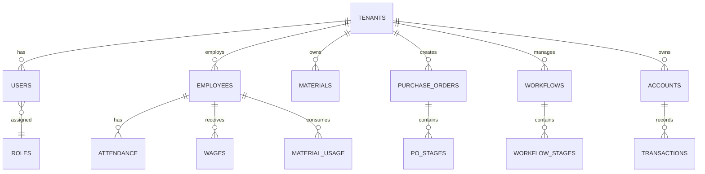

---

# 10. Database Layer Overview

The application follows a layered architecture to separate responsibilities.

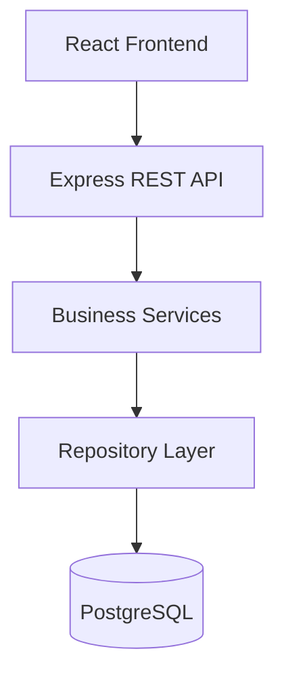

### Layer Responsibilities

| Layer | Responsibility |
|--------|----------------|
| Frontend | Collects user input and displays data |
| API | Receives HTTP requests and returns responses |
| Service | Applies business rules and validation |
| Repository | Handles database queries |
| PostgreSQL | Stores and retrieves data |

This separation keeps the codebase modular, easier to test, and easier to maintain.

---

## Next Section

---

# 11. Core Database Tables (Section 2A)

The following tables form the foundation of the entire ERP system. Every other module—Employees, Inventory, Purchase Orders, Accounts, Attendance, and Reports—depends on these tables.

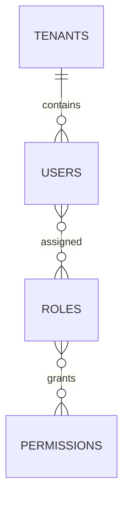

---

# 11.1 Tenants Table

## Purpose

The **tenants** table stores information about each factory registered in the ERP system.

Since the application follows a **Multi-Tenant Architecture**, every factory represents a tenant.

Every business record in the database references a tenant.

Without this table, it would be impossible to isolate factory data.

---

## Table Structure

| Column | Data Type | Constraints | Description |
|----------|----------|------------|-------------|
| id | UUID | PK | Unique tenant identifier |
| company_name | VARCHAR(200) | NOT NULL | Factory name |
| company_code | VARCHAR(50) | UNIQUE | Unique factory code |
| email | VARCHAR(255) | UNIQUE | Factory email |
| phone | VARCHAR(20) | | Contact number |
| address | TEXT | | Factory address |
| city | VARCHAR(100) | | City |
| country | VARCHAR(100) | | Country |
| status | ENUM | Active, Suspended, Inactive | Tenant status |
| logo_url | TEXT | NULL | Company logo |
| created_at | TIMESTAMP | NOT NULL | Record creation |
| updated_at | TIMESTAMP | NOT NULL | Last update |
| deleted_at | TIMESTAMP | NULL | Soft delete |

---

## Example Record

| id | company_name | company_code | status |
|----|--------------|--------------|---------|
| UUID | ABC Textile Mills | ABC001 | Active |
| UUID | Fast Garments | FG001 | Active |

---

## Business Rules

- Every tenant must have a unique company code.
- Every tenant has one primary administrator.
- Tenant data must never be visible to another tenant.
- Deleting a tenant should never permanently remove business data.
- Tenant status controls system access.

---

## Relationships

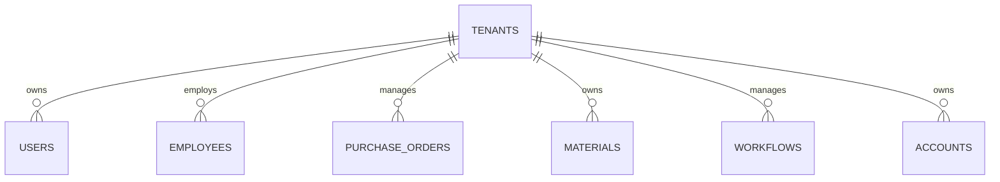

---

## Recommended Indexes

| Index | Reason |
|---------|--------|
| company_code | Fast lookup |
| email | Login & communication |
| status | Active tenant filtering |

---

## Why Separate Tenant Table?

Using a dedicated tenant table allows:

- Better scalability
- Centralized tenant management
- Subscription support
- Easy onboarding
- Future billing integration
- Tenant-level settings

---

# 11.2 Users Table

## Purpose

The **users** table stores all authenticated users who can access the system.

A user may be:

- Super Admin
- Factory Admin
- Manager *(future)*
- Accountant *(future)*
- Employee *(future if login access is provided)*

The table only stores authentication and profile information.

Business-related employee information is stored separately in the **employees** table.

---

## Why Separate Users and Employees?

A user account represents **system access**, while an employee represents a **person working in the factory**.

Examples:

- An accountant may have a login but is not part of production.
- Some employees may never log into the system.
- A Super Admin is not an employee of any factory.

Separating authentication from HR data keeps the design flexible and avoids unnecessary duplication.

---

## Table Structure

| Column | Data Type | Constraints | Description |
|----------|----------|------------|-------------|
| id | UUID | PK | User identifier |
| tenant_id | UUID | FK | Factory |
| first_name | VARCHAR(100) | NOT NULL | First name |
| last_name | VARCHAR(100) | NOT NULL | Last name |
| email | VARCHAR(255) | UNIQUE | Login email |
| password_hash | TEXT | NOT NULL | Encrypted password |
| phone | VARCHAR(20) | NULL | Phone |
| profile_image | TEXT | NULL | Profile photo |
| last_login | TIMESTAMP | NULL | Last login |
| email_verified | BOOLEAN | Default FALSE | Verification status |
| is_active | BOOLEAN | Default TRUE | Active account |
| created_at | TIMESTAMP | NOT NULL | Creation date |
| updated_at | TIMESTAMP | NOT NULL | Last update |
| deleted_at | TIMESTAMP | NULL | Soft delete |

---

## Example Record

| First Name | Email | Tenant | Status |
|-------------|--------|---------|--------|
| Muhammad | admin@factory.com | ABC Textile | Active |
| Aleena | owner@abc.com | ABC Textile | Active |
| Super | superadmin@erp.com | Platform | Active |

---

## Business Rules

- Email must be unique.
- Passwords must never be stored in plain text.
- Passwords must be hashed using bcrypt.
- Deleted users cannot log in.
- Inactive users cannot access the system.
- Email verification should be required before first login (optional for v1).

---

## Authentication Flow

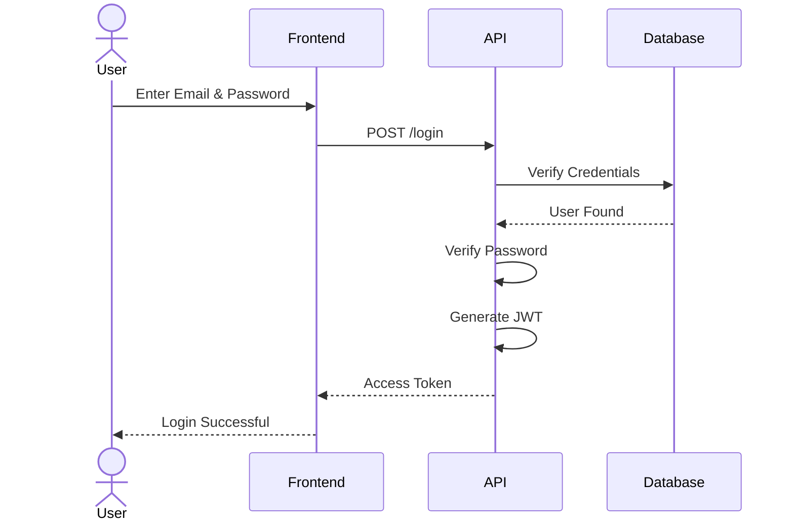

---

## Recommended Indexes

| Index | Reason |
|---------|--------|
| email | Login lookup |
| tenant_id | Tenant filtering |
| is_active | Active user queries |

---

## Security Considerations

Passwords are never stored directly.

Instead:

```text
User Password

↓

bcrypt Hash

↓

Stored in Database
```

Example:

```text
$2b$12$Ksjf9sK3nXvJ0.....
```

Even database administrators cannot recover the original password.

---

## Relationships

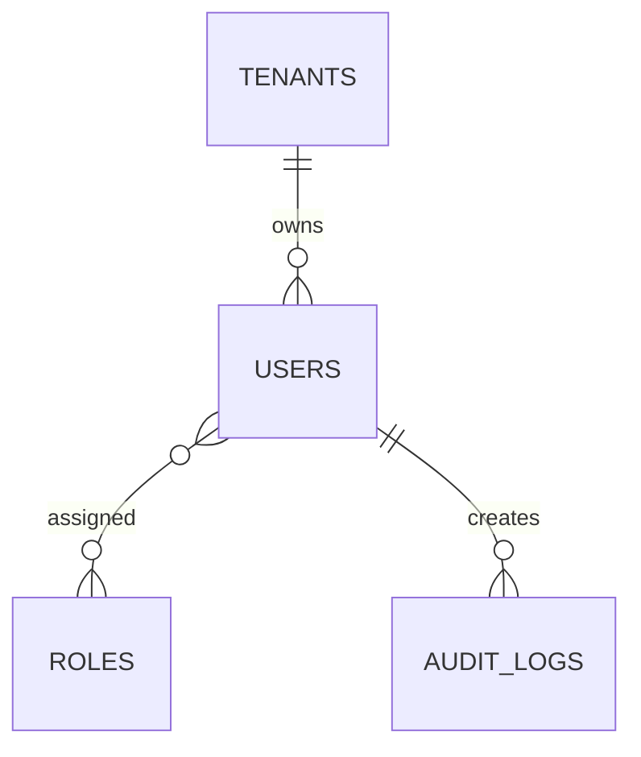

---

## Design Decisions

### UUID Instead of Integer IDs

Reasons:

- Harder to guess
- Better for distributed systems
- Easier future microservices migration

---

### Soft Deletes

Instead of removing users permanently:

```text
deleted_at = NULL

↓

User Active

deleted_at = 2026-07-15

↓

User Archived
```

Advantages:

- Prevent accidental data loss
- Maintain audit history
- Restore deleted accounts
- Preserve historical references

---

## Summary

At this point, the database supports:

- Multi-tenancy
- User authentication
- Secure password storage
- Tenant isolation
- Soft deletes
- Audit-ready records
- Future scalability

These two tables serve as the foundation for every other module in the ERP system.

---

## Next Section (2B)

T---

# 12. Role-Based Access Control (RBAC) (Section 2B)

The Factory Management System uses **Role-Based Access Control (RBAC)** to manage what users are allowed to see and do.

Instead of assigning permissions directly to every user, permissions are assigned to **Roles**, and users receive those permissions through their assigned roles.

This approach is scalable, secure, and easy to maintain.

---

# RBAC Architecture

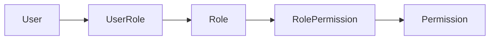

---

# Why RBAC?

Without RBAC:

- Every user would require individual permissions.
- Permission management becomes difficult.
- Adding new roles requires code changes.

With RBAC:

- Easy permission management
- Reusable roles
- Better security
- Easier maintenance

---

# 12.1 Roles Table

## Purpose

The **roles** table defines the different user roles available in the system.

Roles determine what actions users are allowed to perform.

---

## Initial Roles

| Role | Description |
|-------|-------------|
| Super Admin | Platform administrator |
| Factory Admin | Factory manager |
| Manager *(Future)* | Production supervisor |
| Accountant *(Future)* | Finance management |
| Employee *(Future)* | Limited system access |

---

## Table Structure

| Column | Type | Constraints | Description |
|---------|------|------------|-------------|
| id | UUID | PK | Role identifier |
| name | VARCHAR(100) | UNIQUE | Role name |
| description | TEXT | | Role description |
| is_system_role | BOOLEAN | Default TRUE | Prevent accidental deletion |
| created_at | TIMESTAMP | NOT NULL | Creation timestamp |
| updated_at | TIMESTAMP | NOT NULL | Last update |

---

## Example Records

| Name | Description |
|------|-------------|
| Super Admin | Platform administrator |
| Factory Admin | Factory administrator |
| Manager | Production manager |
| Accountant | Financial manager |

---

## Business Rules

- Role names must be unique.
- System roles cannot be deleted.
- Multiple users can share the same role.
- A role can contain multiple permissions.

---

## Recommended Indexes

| Index | Purpose |
|--------|---------|
| name | Fast lookup |

---

# Relationships

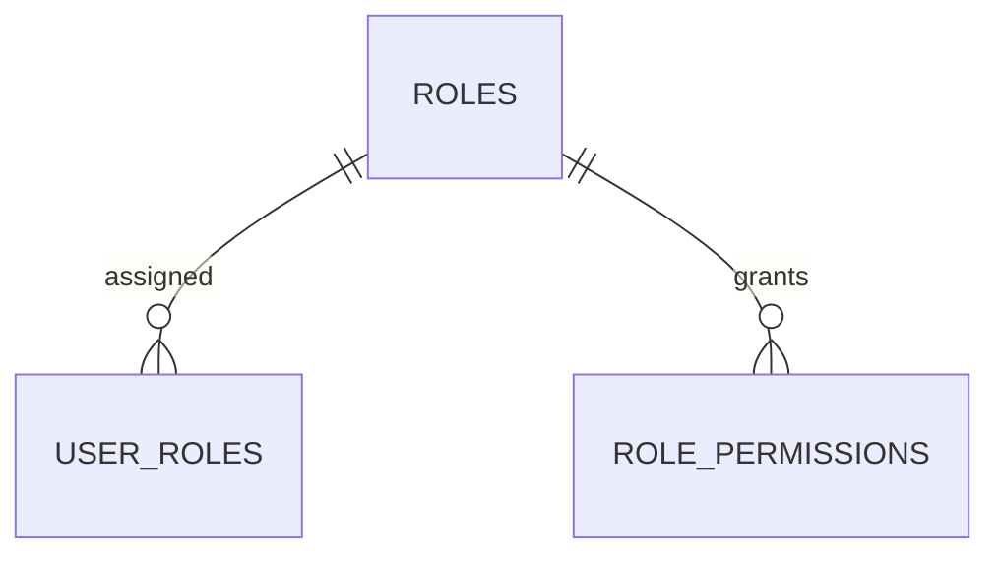

---

# 12.2 Permissions Table

## Purpose

Permissions represent individual actions users are allowed to perform.

Examples:

- Create Employee
- Delete Employee
- Create Purchase Order
- View Dashboard

Instead of hardcoding permissions in code, they are stored in the database.

---

## Permission Naming Convention

Use the following format:

```
resource.action
```

Examples

```
employee.create

employee.update

employee.delete

attendance.view

purchase_order.create

purchase_order.update

accounts.view

dashboard.view
```

---

## Table Structure

| Column | Type | Constraints | Description |
|---------|------|------------|-------------|
| id | UUID | PK | Permission ID |
| name | VARCHAR(100) | UNIQUE | Permission name |
| module | VARCHAR(100) | | Module name |
| description | TEXT | | Permission description |
| created_at | TIMESTAMP | | Creation timestamp |

---

## Example Records

| Permission | Module |
|------------|--------|
| employee.create | Employees |
| employee.update | Employees |
| employee.delete | Employees |
| employee.view | Employees |
| purchase_order.create | Purchase Orders |
| purchase_order.view | Purchase Orders |
| accounts.view | Accounts |

---

## Business Rules

- Permission names must be unique.
- Permissions should never be duplicated.
- Permissions should represent one action only.

Good

```
employee.create
```

Bad

```
employee_management
```

---

## Relationships

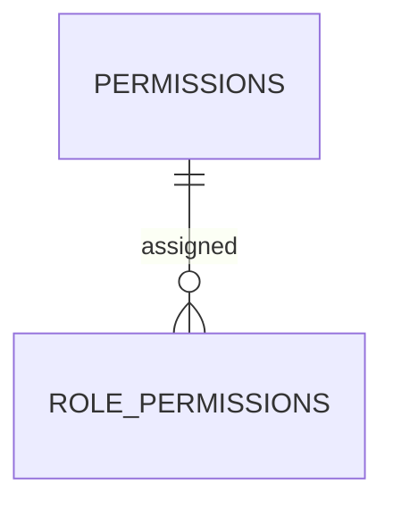

---

# 12.3 Role Permissions Table

## Purpose

This is a junction table that connects Roles and Permissions.

A role can have many permissions.

A permission can belong to many roles.

This creates a **Many-to-Many Relationship**.

---

## Relationship

```text
Factory Admin

↓

employee.create

employee.update

employee.delete

purchase_order.create

purchase_order.update

attendance.view

dashboard.view
```

---

## Table Structure

| Column | Type | Constraints | Description |
|---------|------|------------|-------------|
| id | UUID | PK | Identifier |
| role_id | UUID | FK | Role |
| permission_id | UUID | FK | Permission |
| created_at | TIMESTAMP | | Creation date |

---

## Example Records

| Role | Permission |
|------|------------|
| Factory Admin | employee.create |
| Factory Admin | employee.update |
| Factory Admin | purchase_order.create |
| Super Admin | tenant.create |
| Super Admin | tenant.delete |

---

## Business Rules

- Duplicate assignments are not allowed.
- Every permission must belong to an existing role.
- Deleting a role removes its permission assignments.

---

## Composite Unique Constraint

```
(role_id, permission_id)
```

This prevents duplicate permission assignments.

---

## Relationships

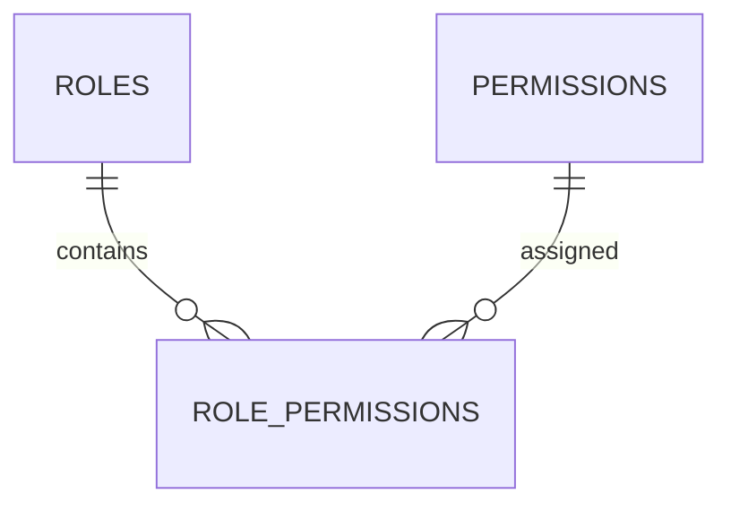

---

# 12.4 User Roles Table

## Purpose

A user may have one or more roles.

Instead of storing the role directly in the Users table, a junction table provides flexibility.

Examples:

- A Factory Admin could also be an Accountant.
- A Manager may temporarily receive Inventory permissions.

---

## Table Structure

| Column | Type | Constraints | Description |
|---------|------|------------|-------------|
| id | UUID | PK | Identifier |
| user_id | UUID | FK | User |
| role_id | UUID | FK | Assigned role |
| assigned_at | TIMESTAMP | | Assignment date |
| assigned_by | UUID | FK Users | Assigned by |

---

## Example Records

| User | Role |
|------|------|
| Muhammad Talha | Factory Admin |
| Aleena Akram | Factory Admin |
| Platform Owner | Super Admin |

---

## Business Rules

- A user may have multiple roles.
- Every role assignment must reference a valid user and role.
- Duplicate assignments are not allowed.
- Removing a user removes all role assignments.

---

## Composite Unique Constraint

```
(user_id, role_id)
```

---

## Relationships

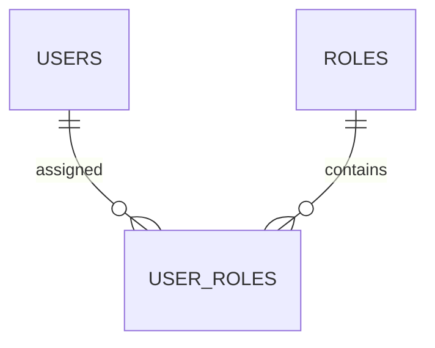

---

# 13. Complete RBAC Entity Relationship Diagram

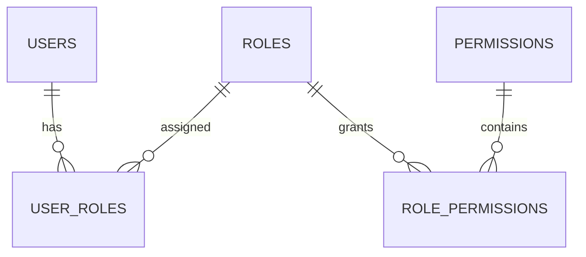

---

# 14. Example Permission Matrix

| Module | Super Admin | Factory Admin | Manager | Employee |
|---------|:-----------:|:-------------:|:-------:|:--------:|
| Manage Tenants | ✅ | ❌ | ❌ | ❌ |
| Dashboard | ✅ | ✅ | ✅ | ✅ |
| Employees | ✅ | ✅ | ✅ | View |
| Attendance | ✅ | ✅ | ✅ | View Own |
| Wages | ✅ | ✅ | View | View Own |
| Inventory | ✅ | ✅ | ✅ | ❌ |
| Purchase Orders | ✅ | ✅ | ✅ | View Assigned |
| Workflows | ✅ | ✅ | ✅ | Update Assigned |
| Accounts | ✅ | ✅ | View | ❌ |
| Reports | ✅ | ✅ | View | ❌ |

---

# 15. Why This Design?

This RBAC design offers several advantages:

- No permission logic is hardcoded.
- New roles can be added without changing the application code.
- Permissions can be updated through the database.
- Multiple roles can be assigned to a single user.
- The system is flexible enough to support future business requirements.

---

# Summary

The authentication and authorization foundation is now complete.

Current core tables include:

- ✅ tenants
- ✅ users
- ✅ roles
- ✅ permissions
- ✅ role_permissions
- ✅ user_roles

These six tables provide secure authentication, role-based authorization, and tenant isolation for the entire ERP system.

---

## Next Section (2C)
---

# 13. Database Standards & Best Practices (Section 2C)

This section defines the database standards that every table in the Factory Management System must follow. These conventions ensure consistency, maintainability, scalability, and data integrity across the application.

---

# 13.1 Primary Key Strategy

Every table uses a **UUID** as its primary key.

Example:

```sql
id UUID PRIMARY KEY DEFAULT gen_random_uuid()
```

### Why UUID?

| Benefit | Explanation |
|----------|-------------|
| Globally Unique | IDs remain unique across all systems |
| Security | Difficult to guess sequential records |
| Scalability | Suitable for distributed systems |
| Future-Proof | Supports future microservices |

---

# 13.2 Foreign Key Standards

All relationships must be enforced using foreign keys.

Example:

```sql
employee_id UUID REFERENCES employees(id)
```

Benefits:

- Prevents orphan records
- Maintains referential integrity
- Improves data consistency

---

## Example

```text
Employees

ID = EMP001

↓

Attendance

employee_id = EMP001
```

Deleting an employee should follow the configured cascade policy rather than leaving invalid references.

---

# 13.3 Multi-Tenant Enforcement

Every business table must contain a `tenant_id`.

Example tables:

- employees
- attendance
- wages
- purchase_orders
- materials
- workflows
- accounts
- transactions

Example:

```text
employees

id
tenant_id
name
designation
```

Every database query should filter by `tenant_id`.

Example:

```sql
SELECT *
FROM employees
WHERE tenant_id = :tenantId;
```

Never return data without tenant filtering.

---

# 13.4 Audit Columns

All business tables should include standard audit fields.

| Column | Description |
|----------|-------------|
| created_at | Record creation time |
| updated_at | Last modification |
| created_by | User who created the record |
| updated_by | User who last modified the record |

Example:

| Employee | Created By | Updated By |
|------------|------------|------------|
| Ali | Admin | Manager |

These fields improve accountability and troubleshooting.

---

# 13.5 Soft Delete Strategy

Records should not be permanently deleted.

Instead of:

```sql
DELETE FROM employees;
```

Use:

```sql
UPDATE employees
SET deleted_at = NOW();
```

---

## Why Soft Deletes?

Advantages:

- Prevent accidental data loss
- Preserve historical records
- Simplify recovery
- Maintain relationships

---

## Example

Before:

```text
deleted_at = NULL
```

After deletion:

```text
deleted_at = 2026-07-15 11:30
```

Applications should ignore records where `deleted_at IS NOT NULL`.

---

# 13.6 Timestamp Standards

Every table should include timestamps.

```sql
created_at

updated_at
```

Automatically:

- `created_at` is set on insert.
- `updated_at` is updated whenever the record changes.

---

# 13.7 Naming Standards

## Tables

Use:

```
snake_case
plural
```

Examples:

```
employees
purchase_orders
workflow_stages
raw_materials
```

---

## Columns

Use:

```
snake_case
```

Examples:

```
employee_name

phone_number

created_at
```

---

## Foreign Keys

```
employee_id

tenant_id

workflow_id

purchase_order_id
```

---

## Index Names

```
idx_users_email

idx_employee_tenant

idx_po_status
```

---

## Foreign Key Names

```
fk_employee_tenant

fk_attendance_employee

fk_po_workflow
```

---

## Unique Constraints

```
uq_users_email

uq_company_code
```

---

# 13.8 Indexing Strategy

Indexes improve query performance.

Create indexes for:

- Foreign Keys
- Frequently searched columns
- Login fields
- Status fields
- Date fields

---

## Example

```sql
CREATE INDEX idx_users_email
ON users(email);
```

---

## Recommended Indexes

| Table | Column |
|----------|--------|
| users | email |
| users | tenant_id |
| employees | tenant_id |
| employees | designation |
| purchase_orders | status |
| purchase_orders | tenant_id |
| attendance | employee_id |
| attendance | attendance_date |
| raw_materials | material_name |

---

# 13.9 Unique Constraints

Prevent duplicate data.

Examples:

Users

```text
Email
```

Factories

```text
Company Code
```

Purchase Orders

```text
PO Number
```

Employees

```text
Employee Code
```

Example:

```sql
UNIQUE(email)
```

---

# 13.10 Check Constraints

Check constraints prevent invalid data.

Examples

Salary

```sql
salary >= 0
```

Stock

```sql
quantity >= 0
```

Age

```sql
age >= 18
```

Attendance

```text
Present

Absent

Leave
```

---

# 13.11 Transactions

Business operations involving multiple tables should use database transactions.

Example:

Creating a Purchase Order:

```
Insert PO

↓

Insert Workflow

↓

Assign Employees

↓

Reserve Inventory

↓

Create Financial Record
```

If any step fails:

```
ROLLBACK
```

Nothing is saved.

---

# 13.12 Database Views

Views simplify reporting.

Examples:

```
employee_summary

inventory_summary

attendance_summary

purchase_order_summary

financial_summary
```

Benefits:

- Cleaner SQL
- Reusable reports
- Better readability

---

# 13.13 Triggers

Triggers automate repetitive database tasks.

Possible triggers:

- Update `updated_at`
- Generate audit logs
- Update stock after material usage
- Update purchase order status
- Record financial transactions

Example:

```
Material Used

↓

Trigger

↓

Inventory Updated
```

---

# 13.14 Data Validation

Validation should occur at multiple layers.

```text
Frontend

↓

Backend

↓

Database Constraints
```

Example:

User enters:

```
-500
```

Validation sequence:

- Frontend rejects
- Backend validates
- Database constraint prevents insertion

This layered approach improves security and reliability.

---

# 13.15 Backup Strategy

Recommended backup schedule:

| Backup Type | Frequency |
|--------------|-----------|
| Full Backup | Daily |
| Incremental Backup | Every Hour |
| Transaction Logs | Continuous |

Backups should be stored in a secure off-site location.

---

# 13.16 Database Security Best Practices

- Use strong database passwords.
- Restrict database access to trusted services.
- Enable SSL/TLS for database connections.
- Store credentials in environment variables.
- Encrypt backups.
- Follow the principle of least privilege.
- Monitor and audit database access.

---

# 13.17 Database Architecture Summary

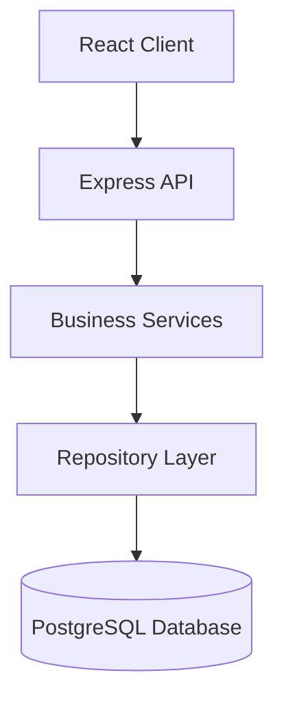

---

# 13.18 Database Design Checklist

| Requirement | Status |
|-------------|:------:|
| Multi-Tenant Support | ✅ |
| UUID Primary Keys | ✅ |
| Foreign Keys | ✅ |
| Normalized Schema | ✅ |
| Audit Fields | ✅ |
| Soft Deletes | ✅ |
| Indexing Strategy | ✅ |
| Constraints | ✅ |
| Transactions | ✅ |
| Security Standards | ✅ |
| Backup Strategy | ✅ |
| Naming Conventions | ✅ |

---

# 13.19 Conclusion

The foundational database architecture for the Factory Management System is now complete. By adopting UUID-based primary keys, enforcing tenant isolation, applying consistent naming conventions, using audit fields, soft deletes, transactions, and proper indexing, the database is designed to be secure, maintainable, and scalable.

These standards will be followed throughout all remaining database modules to ensure consistency and support future growth without requiring major structural changes.

---

