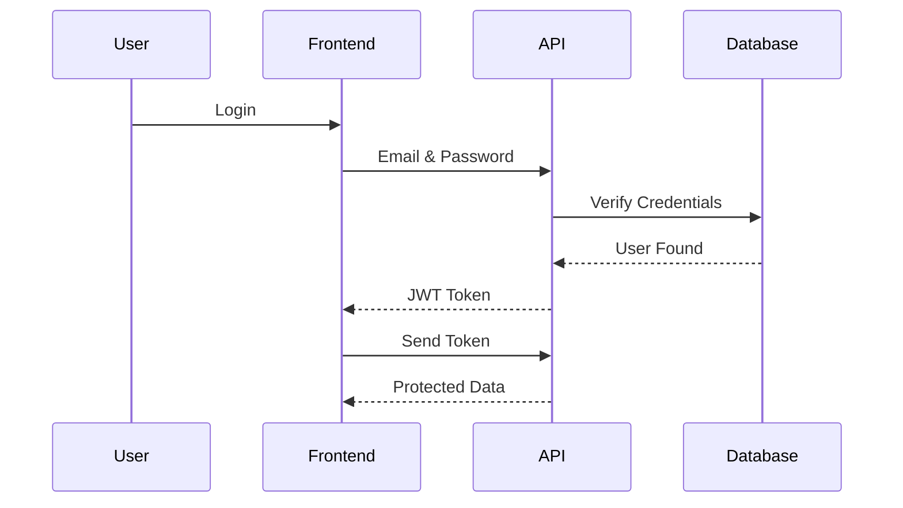

# API Documentation (Part 1)

**Project Name:** Factory Management System (ERP)

**API Version:** v1

**Document Version:** 1.0

---

# Table of Contents

1. API Overview
2. API Architecture
3. Base URL
4. Authentication
5. HTTP Methods
6. Request Format
7. Response Format
8. Status Codes
9. Error Handling
10. Pagination
11. Filtering & Sorting
12. API Versioning
13. Security Best Practices

---

# 1. API Overview

## Purpose

The Factory Management System exposes a RESTful API that allows frontend applications, mobile apps, and third-party systems to securely interact with the ERP.

The API provides access to:

- Authentication
- User Management
- Employee Management
- Customer Management
- Purchase Orders
- Inventory
- Production Workflow
- Attendance
- Payroll
- Reports
- Dashboard

---

## API Architecture

```mermaid
flowchart LR

Frontend

-->

REST API

-->

Business Services

-->

Database
```

The frontend communicates only with the REST API. The API contains all business logic and interacts with the database.

---

# 2. API Standards

The API follows REST principles.

## Naming Convention

Use plural nouns.

Examples:

```
/users

/employees

/customers

/purchase-orders

/raw-materials

/workflows
```

Avoid verbs in endpoint names.

❌ Incorrect

```
/getEmployees

/createEmployee

/deleteEmployee
```

✅ Correct

```
GET /employees

POST /employees

DELETE /employees/{id}
```

---

# 3. Base URL

Development

```text
http://localhost:5000/api/v1
```

Production

```text
https://api.yourfactoryerp.com/api/v1
```

Every endpoint starts with

```text
/api/v1
```

Example

```text
GET /api/v1/employees
```

---

# 4. Authentication

The API uses **JWT (JSON Web Token)** for authentication.

### Authentication Flow



---

## Authorization Header

Every protected request must include:

```http
Authorization: Bearer <access_token>
```

Example

```http
GET /api/v1/employees

Authorization: Bearer eyJhbGciOi...
```

---

# 5. HTTP Methods

| Method | Purpose |
|---------|---------|
| GET | Retrieve data |
| POST | Create data |
| PUT | Replace existing data |
| PATCH | Partially update data |
| DELETE | Soft delete data |

---

## Example

Retrieve employees

```http
GET /employees
```

Create employee

```http
POST /employees
```

Update employee

```http
PUT /employees/{id}
```

Delete employee

```http
DELETE /employees/{id}
```

---

# 6. Request Format

Requests are sent as JSON.

Example

```json
{
  "firstName": "Muhammad",
  "lastName": "Talha",
  "departmentId": "uuid",
  "designationId": "uuid",
  "salaryType": "Monthly"
}
```

---

## Request Headers

```http
Content-Type: application/json

Authorization: Bearer TOKEN
```

---

# 7. Response Format

Every API response follows a consistent structure.

## Success Response

```json
{
  "success": true,
  "message": "Employee created successfully.",
  "data": {
    "id": "uuid"
  }
}
```

---

## List Response

```json
{
  "success": true,
  "message": "Employees fetched successfully.",
  "data": [],
  "pagination": {
    "page": 1,
    "limit": 20,
    "total": 150,
    "totalPages": 8
  }
}
```

---

## Error Response

```json
{
  "success": false,
  "message": "Validation failed.",
  "errors": [
    {
      "field": "email",
      "message": "Email already exists."
    }
  ]
}
```

---

# 8. HTTP Status Codes

| Code | Meaning |
|------|---------|
| 200 | OK |
| 201 | Created |
| 204 | No Content |
| 400 | Bad Request |
| 401 | Unauthorized |
| 403 | Forbidden |
| 404 | Not Found |
| 409 | Conflict |
| 422 | Validation Error |
| 500 | Internal Server Error |

---

# 9. Error Handling

The API always returns meaningful error messages.

Example

```json
{
  "success": false,
  "message": "Employee not found."
}
```

Validation Example

```json
{
  "success": false,
  "message": "Validation failed.",
  "errors": [
    {
      "field": "phone",
      "message": "Phone number is required."
    }
  ]
}
```

---

# 10. Pagination

Large datasets should always be paginated.

Example Request

```http
GET /employees?page=1&limit=20
```

Example Response

```json
{
  "data": [],
  "pagination": {
    "page": 1,
    "limit": 20,
    "total": 350,
    "totalPages": 18
  }
}
```

---

# 11. Filtering & Sorting

The API supports filtering.

Examples

Filter active employees

```http
GET /employees?status=active
```

Filter department

```http
GET /employees?department=production
```

Search

```http
GET /employees?search=talha
```

Sorting

```http
GET /employees?sort=name
```

Descending

```http
GET /employees?sort=-createdAt
```

---

# 12. API Versioning

API versions are included in the URL.

Example

```text
/api/v1/employees

/api/v2/employees
```

This allows future upgrades without breaking existing applications.

---

# 13. Security Best Practices

The API should follow these security guidelines:

- Use HTTPS in production.
- Authenticate all protected endpoints using JWT.
- Validate every request on the server.
- Sanitize all user input.
- Hash passwords using bcrypt.
- Never expose sensitive information in API responses.
- Apply role-based access control (RBAC).
- Implement rate limiting to prevent abuse.
- Log authentication attempts and critical actions.
- Return generic error messages for authentication failures.

---

# API Design Principles

The Factory Management System API follows these principles:

- RESTful architecture
- Consistent endpoint naming
- Stateless communication
- Standard HTTP methods
- JSON request and response format
- Secure authentication
- Predictable error handling
- Scalable versioning strategy
- Pagination for large datasets
- Filtering and sorting support

---

# Next Document

## API Documentation (Part 2)

The next part will cover:

- Authentication APIs
- User Management APIs
- Role Management APIs
- Permission Management APIs
- Complete request and response examples
- Authentication flow diagrams
- RBAC implementation