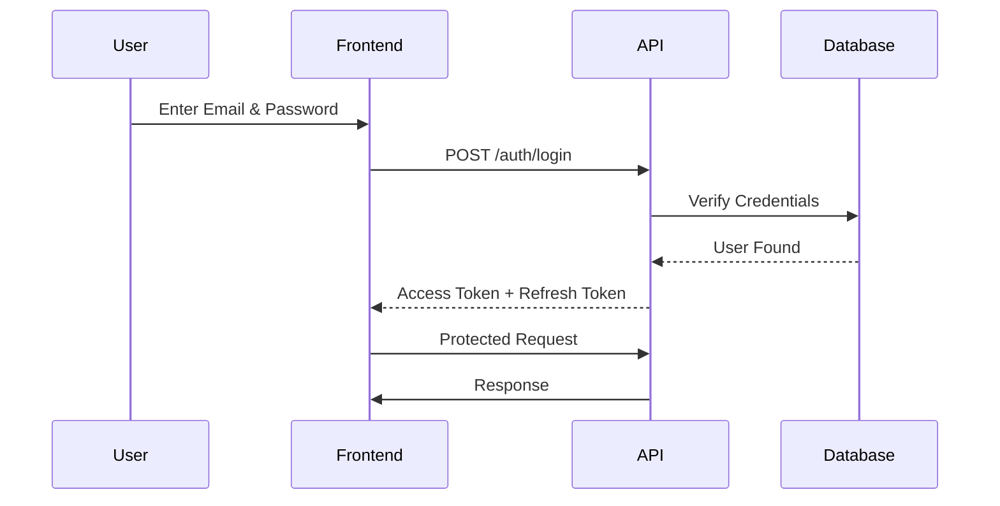

# API Documentation (Part 2)

**Project Name:** Factory Management System (ERP)

**API Version:** v1

**Document Version:** 1.0

---

# Table of Contents

1. Authentication Module
2. Login API
3. Refresh Token API
4. Logout API
5. Get Current User
6. User Management
7. Role Management
8. Permission Management
9. RBAC Flow
10. API Summary

---

# 1. Authentication Module

## Purpose

The Authentication module verifies user identity before allowing access to the system.

The ERP uses:

- JWT Access Tokens
- Refresh Tokens
- Role-Based Access Control (RBAC)

Every protected API requires a valid JWT access token.

---

# Authentication Flow



---

# 2. Login API

## Endpoint

```http
POST /api/v1/auth/login
```

---

## Description

Authenticates a user and returns JWT tokens.

---

## Request Body

```json
{
  "email": "admin@factory.com",
  "password": "password123"
}
```

---

## Success Response

```json
{
  "success": true,
  "message": "Login successful.",
  "data": {
    "user": {
      "id": "uuid",
      "name": "Muhammad Talha",
      "email": "admin@factory.com",
      "role": "Admin"
    },
    "accessToken": "JWT_ACCESS_TOKEN",
    "refreshToken": "JWT_REFRESH_TOKEN"
  }
}
```

---

## Error Response

```json
{
  "success": false,
  "message": "Invalid email or password."
}
```

---

# Business Rules

- Email is required.
- Password is required.
- Account must be active.
- Account must not be locked.

---

# 3. Refresh Token API

## Endpoint

```http
POST /api/v1/auth/refresh
```

---

## Purpose

Generates a new access token using a valid refresh token.

---

## Request

```json
{
  "refreshToken": "JWT_REFRESH_TOKEN"
}
```

---

## Response

```json
{
  "success": true,
  "data": {
    "accessToken": "NEW_ACCESS_TOKEN"
  }
}
```

---

# 4. Logout API

## Endpoint

```http
POST /api/v1/auth/logout
```

---

## Description

Invalidates the refresh token and logs the user out.

---

## Request Header

```http
Authorization: Bearer ACCESS_TOKEN
```

---

## Response

```json
{
  "success": true,
  "message": "Logged out successfully."
}
```

---

# 5. Get Current User

## Endpoint

```http
GET /api/v1/auth/me
```

---

## Description

Returns the authenticated user's profile.

---

## Response

```json
{
  "success": true,
  "data": {
    "id": "uuid",
    "name": "Muhammad Talha",
    "email": "admin@factory.com",
    "role": "Admin"
  }
}
```

---

# Authentication Middleware

Every protected endpoint uses middleware.

```text
Client

↓

JWT Token

↓

Authentication Middleware

↓

Authorization Middleware

↓

API Controller

↓

Database
```

---

# 6. User Management APIs

Users are people who can log into the ERP.

Examples:

- Super Admin
- Factory Admin
- Manager
- HR
- Accountant

---

## Get All Users

```http
GET /api/v1/users
```

---

## Get User

```http
GET /api/v1/users/{id}
```

---

## Create User

```http
POST /api/v1/users
```

### Request

```json
{
  "name": "Ali Raza",
  "email": "ali@factory.com",
  "password": "password123",
  "roleId": "uuid"
}
```

---

## Update User

```http
PUT /api/v1/users/{id}
```

---

## Delete User

```http
DELETE /api/v1/users/{id}
```

---

# User Response Example

```json
{
  "success": true,
  "message": "User created successfully.",
  "data": {
    "id": "uuid",
    "name": "Ali Raza"
  }
}
```

---

# User Business Rules

- Email must be unique.
- Password is hashed before storage.
- Users are soft deleted.
- Every user has at least one role.

---

# 7. Role Management APIs

Roles define what users are allowed to do.

Examples

- Super Admin
- Admin
- Production Manager
- HR Manager
- Inventory Manager
- Accountant
- Employee

---

## Get Roles

```http
GET /api/v1/roles
```

---

## Create Role

```http
POST /api/v1/roles
```

---

### Request

```json
{
  "name": "Production Manager",
  "description": "Manages factory production."
}
```

---

## Update Role

```http
PUT /api/v1/roles/{id}
```

---

## Delete Role

```http
DELETE /api/v1/roles/{id}
```

---

# 8. Permission APIs

Permissions define what actions a role can perform.

Examples

```
employee.create

employee.read

employee.update

employee.delete

inventory.read

inventory.update

purchase_order.create

workflow.manage
```

---

## Get Permissions

```http
GET /api/v1/permissions
```

---

## Assign Permissions to Role

```http
POST /api/v1/roles/{roleId}/permissions
```

---

### Request

```json
{
  "permissionIds": [
    "uuid1",
    "uuid2",
    "uuid3"
  ]
}
```

---

## Response

```json
{
  "success": true,
  "message": "Permissions assigned successfully."
}
```

---

# RBAC Architecture

```mermaid
flowchart TD

User

-->

Role

-->

Permissions

-->

API Authorization

-->

Business Logic
```

---

# Authorization Example

User

↓

Role = Inventory Manager

↓

Permission

```
inventory.read
```

↓

Allowed

---

User

↓

Role = Employee

↓

Permission

```
inventory.delete
```

↓

Denied

---

# HTTP Status Codes

| Action | Status |
|---------|--------|
| Login Success | 200 |
| User Created | 201 |
| Invalid Login | 401 |
| Forbidden | 403 |
| User Not Found | 404 |
| Validation Error | 422 |

---

# Security Considerations

- Passwords are hashed using bcrypt.
- JWT tokens have expiration times.
- Refresh tokens are securely stored.
- Failed login attempts are logged.
- Account lockout after repeated failed logins.
- RBAC is enforced on every protected endpoint.
- Sensitive fields (e.g., passwords) are never returned in API responses.

---

# Module Summary

This section defines APIs for:

- ✅ Authentication
- ✅ Login
- ✅ Logout
- ✅ Refresh Token
- ✅ Current User
- ✅ User Management
- ✅ Role Management
- ✅ Permission Management
- ✅ Role-Based Access Control (RBAC)

These APIs provide the secure foundation for the rest of the ERP.

---

# Next Document

## API Documentation (Part 3)

The next part will cover:

- Employee APIs
- Department APIs
- Designation APIs
- Attendance APIs
- Wage APIs
- Payroll APIs
- Complete request and response examples