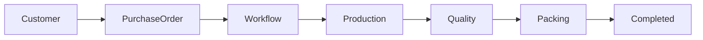
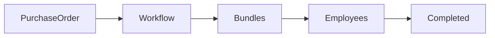
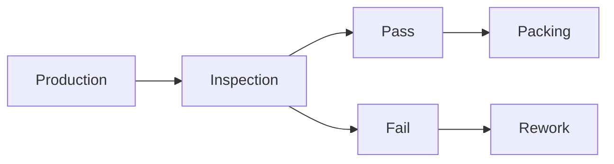

# API Documentation (Part 5)

**Project Name:** Factory Management System (ERP)

**API Version:** v1

**Document Version:** 1.0

---

# Table of Contents

1. Customer APIs
2. Purchase Order APIs
3. Purchase Order Item APIs
4. Workflow APIs
5. Production Bundle APIs
6. Employee Assignment APIs
7. Quality Inspection APIs
8. Production Dashboard APIs
9. Business Rules
10. API Summary

---

# 1. Customer APIs

## Overview

Customers place Purchase Orders that initiate the production process.

---

## Endpoints

| Method | Endpoint | Description |
|---------|----------|-------------|
| GET | `/api/v1/customers` | Get all customers |
| GET | `/api/v1/customers/{id}` | Get customer details |
| POST | `/api/v1/customers` | Create customer |
| PUT | `/api/v1/customers/{id}` | Update customer |
| DELETE | `/api/v1/customers/{id}` | Delete customer |

---

## Create Customer

```http
POST /api/v1/customers
```

### Request

```json
{
    "companyName": "Nike Pakistan",
    "contactPerson": "John Smith",
    "phone": "03001234567",
    "email": "john@nike.com",
    "address": "Lahore, Pakistan"
}
```

---

### Response

```json
{
    "success": true,
    "message": "Customer created successfully."
}
```

---

# Business Rules

- Company name must be unique.
- Customer cannot be deleted if purchase orders exist.

---

# 2. Purchase Order APIs

## Overview

Purchase Orders represent customer orders.

Creating a Purchase Order automatically starts the production workflow.

---

## Endpoints

| Method | Endpoint |
|---------|----------|
| GET | `/api/v1/purchase-orders` |
| GET | `/api/v1/purchase-orders/{id}` |
| POST | `/api/v1/purchase-orders` |
| PUT | `/api/v1/purchase-orders/{id}` |
| DELETE | `/api/v1/purchase-orders/{id}` |

---

## Create Purchase Order

```http
POST /api/v1/purchase-orders
```

### Request

```json
{
    "customerId": "uuid",
    "orderDate": "2026-07-20",
    "deliveryDate": "2026-08-15",
    "remarks": "Urgent delivery",
    "items": [
        {
            "productName": "Polo Shirt",
            "color": "Blue",
            "size": "L",
            "quantity": 1000,
            "unitPrice": 850
        }
    ]
}
```

---

### Response

```json
{
    "success": true,
    "message": "Purchase Order created successfully.",
    "data": {
        "purchaseOrderId": "uuid",
        "workflowId": "uuid"
    }
}
```

---

## Search Purchase Orders

```http
GET /api/v1/purchase-orders?search=PO-1001
```

---

## Filter by Status

```http
GET /api/v1/purchase-orders?status=Production
```

---

## Filter by Customer

```http
GET /api/v1/purchase-orders?customerId=uuid
```

---

# Purchase Order Workflow



---

# 3. Purchase Order Item APIs

Each Purchase Order contains one or more products.

---

## Endpoints

| Method | Endpoint |
|---------|----------|
| GET | `/api/v1/purchase-orders/{id}/items` |
| POST | `/api/v1/purchase-orders/{id}/items` |
| PUT | `/api/v1/purchase-order-items/{id}` |
| DELETE | `/api/v1/purchase-order-items/{id}` |

---

## Response Example

```json
{
    "success": true,
    "data": [
        {
            "productName": "Polo Shirt",
            "quantity": 1000,
            "unitPrice": 850,
            "totalPrice": 850000
        }
    ]
}
```

---

# Business Rules

- Purchase Order must contain at least one item.
- Quantity must be greater than zero.
- Unit price cannot be negative.

---

# 4. Workflow APIs

The Workflow module tracks production progress.

---

## Endpoints

| Method | Endpoint |
|---------|----------|
| GET | `/api/v1/workflows` |
| GET | `/api/v1/workflows/{id}` |
| PATCH | `/api/v1/workflows/{id}/stage` |
| GET | `/api/v1/workflows/{id}/history` |

---

## Update Workflow Stage

```http
PATCH /api/v1/workflows/{id}/stage
```

---

### Request

```json
{
    "stage": "Stitching"
}
```

---

### Response

```json
{
    "success": true,
    "message": "Workflow stage updated successfully."
}
```

---

# Workflow Stages

- Material Allocation
- Cutting
- Stitching
- Embroidery
- Finishing
- Quality Check
- Packing
- Completed

---

# 5. Production Bundle APIs

Large orders are divided into smaller bundles.

---

## Endpoints

| Method | Endpoint |
|---------|----------|
| GET | `/api/v1/bundles` |
| GET | `/api/v1/bundles/{id}` |
| POST | `/api/v1/bundles` |
| PATCH | `/api/v1/bundles/{id}/stage` |

---

## Create Bundle

```http
POST /api/v1/bundles
```

### Request

```json
{
    "workflowId": "uuid",
    "bundleNumber": "B-001",
    "quantity": 500
}
```

---

## Response

```json
{
    "success": true,
    "message": "Bundle created successfully."
}
```

---

# Bundle Flow



---

# 6. Employee Assignment APIs

Assign employees to workflow stages.

---

## Endpoints

| Method | Endpoint |
|---------|----------|
| GET | `/api/v1/assignments` |
| POST | `/api/v1/assignments` |
| PATCH | `/api/v1/assignments/{id}` |

---

## Assign Employee

```http
POST /api/v1/assignments
```

### Request

```json
{
    "workflowId": "uuid",
    "bundleId": "uuid",
    "employeeId": "uuid",
    "stage": "Cutting"
}
```

---

### Response

```json
{
    "success": true,
    "message": "Employee assigned successfully."
}
```

---

# Business Rules

- Employee must be active.
- Bundle must exist.
- Employee cannot have duplicate active assignments.

---

# 7. Quality Inspection APIs

Quality inspections ensure finished products meet customer requirements.

---

## Endpoints

| Method | Endpoint |
|---------|----------|
| GET | `/api/v1/quality-inspections` |
| GET | `/api/v1/quality-inspections/{id}` |
| POST | `/api/v1/quality-inspections` |
| PATCH | `/api/v1/quality-inspections/{id}` |

---

## Record Inspection

```http
POST /api/v1/quality-inspections
```

### Request

```json
{
    "bundleId": "uuid",
    "inspectorId": "uuid",
    "status": "Pass",
    "defectsFound": 0,
    "remarks": "Approved"
}
```

---

### Response

```json
{
    "success": true,
    "message": "Inspection completed successfully."
}
```

---

# Inspection Flow



---

# Business Rules

- Every bundle must be inspected.
- Failed bundles return to production.
- Inspection cannot be deleted after completion.

---

# 8. Production Dashboard APIs

Provides real-time production statistics.

---

## Production Summary

```http
GET /api/v1/dashboard/production
```

---

## Workflow Progress

```http
GET /api/v1/dashboard/workflows
```

---

## Active Bundles

```http
GET /api/v1/dashboard/bundles
```

---

## Employee Productivity

```http
GET /api/v1/dashboard/productivity
```

---

## Dashboard Response

```json
{
    "activeOrders": 18,
    "activeBundles": 72,
    "completedToday": 9,
    "pendingQualityChecks": 5,
    "employeesWorking": 64
}
```

---

# Validation Rules

| Field | Validation |
|---------|------------|
| Customer | Required |
| Purchase Order | Required |
| Delivery Date | Must be after Order Date |
| Quantity | Greater than 0 |
| Workflow Stage | Valid Stage Only |
| Bundle Quantity | Greater than 0 |

---

# Security

| Role | Access |
|------|--------|
| Admin | Full Access |
| Production Manager | Workflow & Bundles |
| Quality Inspector | Quality APIs |
| Sales Manager | Customers & Purchase Orders |
| Employee | View Assigned Bundles |

---

# Module Summary

This module provides APIs for:

- ✅ Customer Management
- ✅ Purchase Orders
- ✅ Purchase Order Items
- ✅ Production Workflows
- ✅ Bundle Tracking
- ✅ Employee Assignments
- ✅ Quality Inspections
- ✅ Production Dashboard

Together, these APIs support the complete production lifecycle from customer order creation to finished product inspection.

---

# Next Document

## API Documentation (Part 6)

The final API documentation will include:

- Dashboard APIs
- Reports APIs
- Notification APIs
- File Upload APIs
- Audit Log APIs
- System Settings APIs
- Search APIs
- Pagination Standards
- Rate Limiting
- Webhooks
- API Best Practices
- Production Deployment Guidelines
```